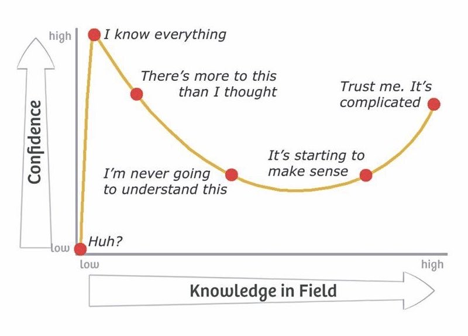
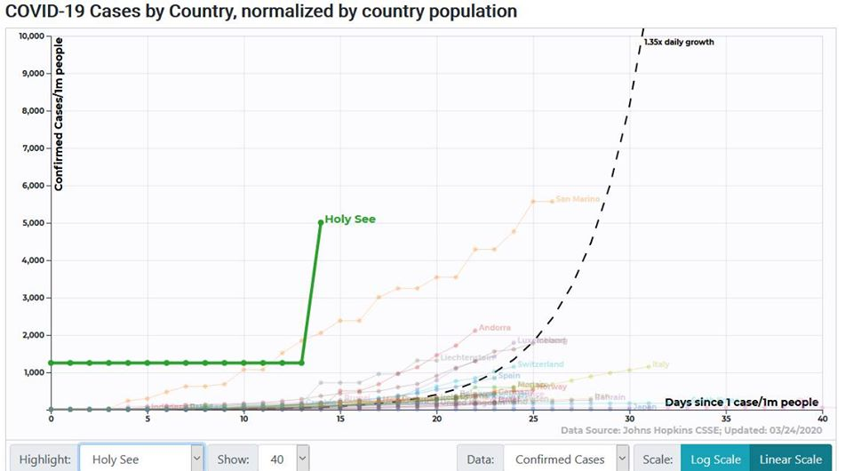

The global impact of the SARS-CoV-2/COVID-19 pandemic, and the salience of eye-catching data visualizations in these times, necessitate a profoundly judicious use of data variables and normalizations. Inappropriate choices in these respects can contribute to misconceptions about the magnitudes of various aspects of the crisis, either in comparison to each other or in comparison to other global issues. Unchecked misconceptions about quantitative data in public health have the potential to enable harm, a hazard which such tags as[\#datasaveslives](https://twitter.com/hashtag/datasaveslives?lang=en)may have the effect of blanketing over.

Epidemiology in particular is wrought with terminology and dynamic relationships which are not immediately intuitive to understand. In the first weeks of COVID-19’s arrival to the English-speaking world, sage precautionary advice in this vein made its way through the data science Twitterverse:

<htmlinject key*\="snippet0" html*="""" />

<htmlinject key*\="snippet1" html*="""" />

^See the linked thread for an imperative discussion on the issues in visualizing COVID. More recent words of wisdom:

<htmlinject key*\="snippet2" html*="""" />

^(Ahem, anyone using a "cubic model".) See the thread below and the Atlantic piece covering the tweet that prompted it for a demonstration of the hazard of well-intentioned but under-informed data analysis.

<htmlinject key*\="snippet3" html*="""" />

Even among infectious disease experts, consensus on the best practices for modeling the incoming data would adapt over time:

<htmlinject key*\="snippet4" html*="""" />

All these epistemological limitations fit under the umbrella of the Dunning-Kruger effect:

Following this evolving consensus on best practices, we can often observe improvements over time in some of the COVID data visualizations which have managed to reach a wider audience, and these revisions are instructive. 

For example, covidactnow.org has added models of the infection growth rate (with confidence intervals) and the positive test rate to its forecasts of state-by-state hospital capacity, which were more simplistic in the site's first few weeks. 

The interactive COVID tool at 91-divoc.com was already making the best of multiple approaches upon its debut, showing gross and per-capita case counts by country and region, and allowing users to toggle between linear and logarithmic scales on the y-axis. Like other popular COVID tools, 91-divoc brackets the x-axes of its graphs around early quantitative thresholds such as days since 100 cases, and by late April had shifted its default view from total cases to one-week trailing averages of new cases to better illustrate flattening growth. In mid-April the site added forecast trendlines for countries, but days later opted to truncate those forecasts to seven days forward so as to “avoid extreme extrapolation”. Peruse 91-divoc’s change log here. The most important prevailing debates on best practices for COVID data visualization concern the proper selection of variables and denominators.

he modeler’s choice between gross counts and per-capita normalizations depends on the purpose of their model. Gross counts accurately measure the growth of local outbreaks, whereas per-capita rates better depict the burden on a nation/region’s healthcare system and policymaking apparatus. Some sentiments in favor of per-capita normalizations are quite inflexble, but perhaps wrongly so. Observe the linear graph of cases by country captured on March 25 from 91-divoc’s tool:

Now observe the linear graph of cases per capita, captured on the same day from the same tool:

Pouring one out for the Vatican City, apparently careening towards anarchy faster than any other nation, would be the incorrect conclusion to draw from these data. Here John Burn-Murdoch, whose graphs for the Financial Times have earned praise, makes his team’s case against using per-capita rates in graphs:

<htmlinject key*\="snippet5" html*="""" />

In this linked thread Carl T. Bergstrom of the University of Washington explains how per-capita rates can be responsibly compared between countries if the curves are left-aligned to starting positions of a given fractional infection rate. However, he also advises that per-capita comparisons between regions are preferable to those between countries.

<htmlinject key*\="snippet6" html*="""" />

There is also volatile disagreement on the proper selection of variables. Many sources, [FiveThirtyEight among them](https://fivethirtyeight.com/features/coronavirus-case-counts-are-meaningless/), point out the futility of using reported case counts from governments (of inconsistent reliability) using inconsistent testing methods. Burn-Murdoch’s detractors critique the face-value acceptance of China’s published counts in his visuals. [Datawrapper](https://blog.datawrapper.de/coronaviruscharts/) advocates for using confirmed death counts instead. What are some general best practices and precautions for analyzing and visualizing COVID data? Here are some excellent sources addressing this question.

* [10 considerations before you create another chart about COVID-19 ](http://news.mit.edu/2020/catherine-dignazio-visualizing-covid-19-data-0414)(03/13/20) by Amanda Makulec, Operations Director for the Data Visualization Society.
* [3 Questions: Catherine D’Ignazio on visualizing COVID-19 data](http://news.mit.edu/2020/catherine-dignazio-visualizing-covid-19-data-0414) (04/13/20) profiling MIT assistant professor D’Ignazio
* [Mapping coronavirus, responsibly ](https://www.esri.com/arcgis-blog/products/product/mapping/mapping-coronavirus-responsibly/)(02/25/20) by Kenneth Field for ESRI.
* [Why It’s So Freaking Hard to Make a Good COVID-19 Model ](https://fivethirtyeight.com/features/why-its-so-freaking-hard-to-make-a-good-covid-19-model/)by Maggie Koerth, Laura Bronner, and Jasmine Mithani for FiveThirtyEight
* Once again, [this Twitter thread ](https://twitter.com/EvanMPeck/status/1235568532840120321)by Evan M. Peck of Bucknell University. 

For trustworthy visualizations, explore these [gems selected by Tableau ](https://www.tableau.com/about/blog/2020/4/most-interesting-data-vizzes-covid-19-weve-seen-media-so-far)or the [charts featured by Datawrapper](https://blog.datawrapper.de/coronaviruscharts/).

The COVID-19 pandemic has underscored the importance of informed epidemiological data analysis. Often, the niche expertise required for this analysis can be a hazard [even to credentialed experts](https://twitter.com/ferrisjabr/status/1221146622341443584). The democratic, collaborative nature of public forum data science can help us meet the demands of this vexing global problem. But, this does not suggest that every individual or team reporting on COVID has an equal claim to accuracy; rather, it implies that the analysis challenges are larger than any one mind can confidently answer.