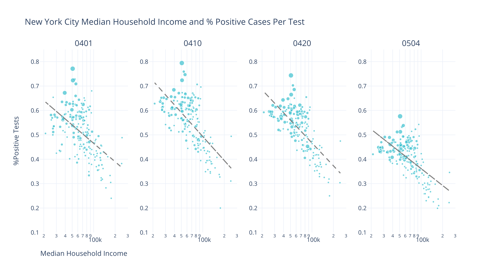
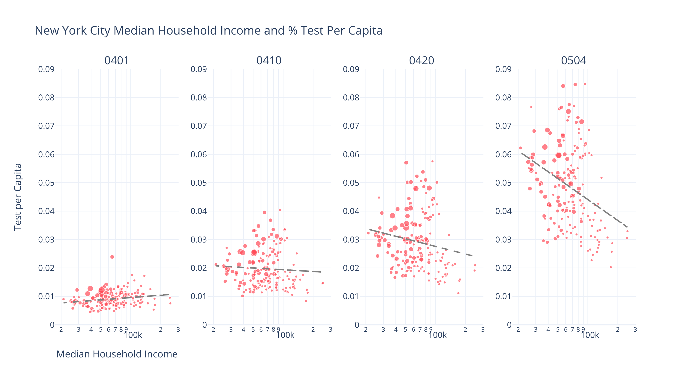
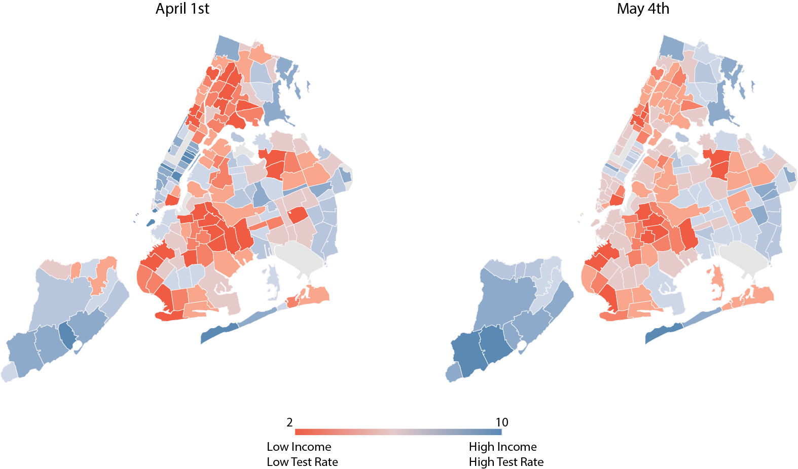
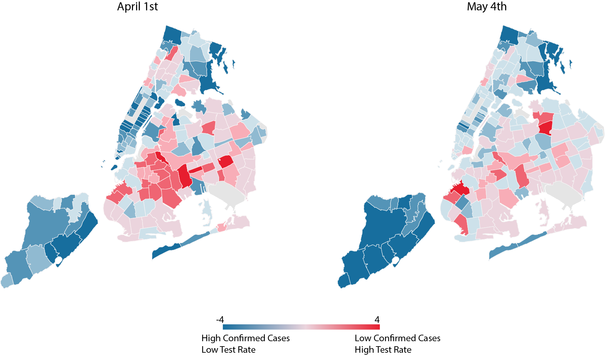

*Chart 1 Caption. Graph shows the changes of test per capita and percentage of positive tests returned. The size of the circle indicate the median household income*

<htmlinject keyid="graph1" htmlid="htmlsparsed.yml" />

## Introduction

[New York City was slow to respond to COVID-19.](https://www.newyorker.com/magazine/2020/05/04/seattles-leaders-let-scientists-take-the-lead-new-yorks-did-not) It took the city officials over a month to shift adequate testing resources to areas that were suffering most: New York's low-income and disproportionately minority neighborhoods and households. 

Many journalists and civil society actors have begun to raise alarm at what is proving to be an economic and social disparity in our governments' response. For the few state and local governments that have released details data on COVID19 fatalities, we are beginning to observe a clear uneven pattern: low-income communities have been much harder hit by COVID19 than high-income communities.  **We also know that \[\*Who is the we?]\*** widespread testing is essential to both helping infected individuals and also containing the virus at a regional level. However, income should not decide whether or not one has access to adequate testing and care.  

Several recent studies have attempted to analyze if state and local testing strategies are disbursed and utilized in more high-income than low-income regions.  Two studies, by Borjas, G. J. (2020) and Schmitt-Grohé (2020) respectively, used zip code level data in New York City. Using data from April 5th, Borjas finds that people residing in poor neighborhoods were less likely to be tested than people residing in rich neighborhoods, while, with data from April 2nd to April 13th, Schmitt-Grohé finds that the distribution of Covid-19 tests was equal across income brackets. 

'in comparing these two results, it become more evident that a key contributing factor in the differences is ***time***.

## Timing is everything.

These confounding conclusions motivated researchers in our lab to explore the relationship of Covid-19 testing, income levels, and time. First, we compare the zip code level testing and confirmed cases data from April 1st to May 4th in New York City**.** Low-income zip codes show a higher fraction of positive testing results across time. Although the data from early April show a higher concentration of testing in high-income zip codes, this trend reversed itself over time in the last month.

Second, to go one step further we divided the median household income and the testing rate per capita into quintiles. We assigned each quintile a score from 1 to 5: 1 representing the lowest quintile and 5 representing the highest quintile. We then add the testing rate per capita score with the household income score created a map that illuminates where there is disparity between income and testing. A score of 10 represents the highest income and  testing rates, while a score of 2 represents lowest income and testing rates. In the map (Graph 4.1) we can see the extreme color of blue and red diminishing between early April and early May. However, there are still places that remain at score 2.

If we plot positive returns per test rate (at zipcode level) by quintile against the test per capita by quintile (Graph 4.2), we show a map with dark red indicating very high likelihood of getting a positive return per test but the overall tests per capita remain low. The blue color indicates the zip code has a very positive per test rate but high test per capita rate. These maps uncover the fact that even with the trend reversing, we still have many zip codes that are left behind. For example, as of May 4th, Flushing in Queens (11355) has a positive cases per test rate as high as 46.7% but their overall test per capita is less than 3%. On the contrary, Staten Island (10305) has a positive cases per test rate at 36.9% and its overall test per capita rate is around 7.2%. 

\[Maps, I could convert these to d3 for better performance]

There are potentially many factors that contributed to New York's decisions on where to allocation COVID19 resources. It could be because her healthcare system is just simply responding to the number of confirmed cases. Whatever the reason, we all have an obligation to understand and learn from these failings in order to better inform more equitable designs and plans. Many of us dont have the luxury of time. So it is left to our planners, policy-makers, and public health officials to ensure that we make the very best of it. To know and never doubt that income should never dictate the acquisition of something so priceless - a life well lived

**\[ Working remotely is a convenience only afforded to high income populations; those who perform the city’s essential services—sanitation, food services and delivery, cab drivers, transit workers—predominantly live in lower income areas. Cities must be concerned foremost with the health of these essential workers, especially as cities are considering reopening in the coming months, to maintain a stable transition and avoid a second wave of the virus.] *This seem tangential***

## Reference:

\
\[1] Borjas, G. J. (2020).*Demographic determinants of testing incidence and COVID-19 infections in New York City neighborhoods*(No. w26952). National Bureau of Economic Research.

\[2] Schmitt-Grohé, S., Teoh, K., & Uribe, M. (2020).*Covid-19: Testing Inequality in New York City*(No. w27019). National Bureau of Economic Research.