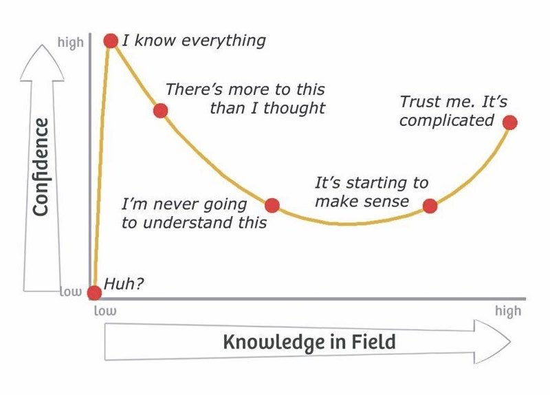
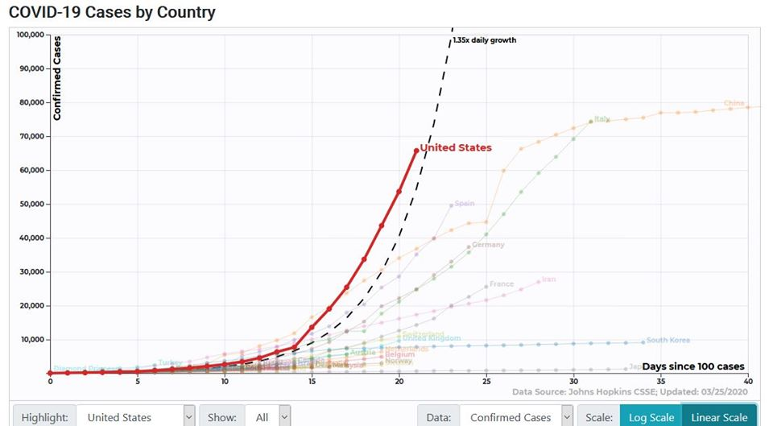
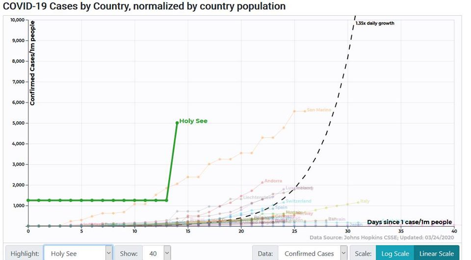

The global importance of the SARS-CoV-2/COVID-19 pandemic, and the salience of eye-catching data visualizations in these times, necessitate a profoundly judicious use of data variables and normalizations. Inappropriate choices in these respects can contribute to misconceptions about the magnitudes of various aspects of the crisis, either in comparison to each other or in comparison to other global issues. Unchecked misconceptions about quantitative data in public health have the potential to enable harm, a hazard which such tags as [\#datasaveslives](https://twitter.com/hashtag/datasaveslives?lang=en) may have the effect of blanketing over.

Epidemiology in particular is wrought with terminology and dynamic relationships which are not immediately intuitive to understand. In the first weeks of COVID-19’s arrival to the English-speaking world, sage precautionary advice in this vein made its way through the data science Twitterverse:

![Tweet by Nate Silver: "This is not unique to coronavirus, but it feels like the people who know the *most* about something often express more uncertainty and doubt than people who have some adjacent knowledge but fall short of  being subject-matter experts. [...] I'm in the high-risk zone for having adjacent, sophomoric knowledge myself (know statistics, have written about epidemiology) which is why I'm mostly trying to shut up about coronavirus. But I will say be wary of overconfidence and trust folks who express uncertainty/doubt."](images/screen-shot-2020-05-19-at-6.40.06-am.png "tweet0")

^See [the thread](https://twitter.com/EvanMPeck/status/1235568532840120321) for an imperative discussion on the issues in visualizing COVID. More recent words of wisdom:

![Tweet by Emma Wager: "Calling for a temporary ban on data visualization until we figure out what is going on [image of graph] I have nothing to promote but please stay home, wash your hands, and stop publishing charts with default Excel formatting"](images/screen-shot-2020-05-19-at-6.44.32-am.png "tweet3")

^(Ahem, anyone using a ["cubic model"](https://twitter.com/bencasselman/status/1258136404363808769).)

See the [thread below](https://twitter.com/ferrisjabr/status/1221145299084726273) and the [*Atlantic* piece covering the tweet that prompted it](https://www.theatlantic.com/technology/archive/2020/01/china-coronavirus-twitter/605644/) for a demonstration of the hazard of well-intentioned but under-informed data analysis.

![Tweet by Ferris Jabr: "Following numerous critiques, the most inaccurate tweet in the original viral thread disappeared/was probably deleted without explanation or follow-up correction. For transparency and posterity, this is what it looked like.  The info in the pictured tweet is unequivocally wrong" [image of tweet by Dr. Eric Feigl Ding: "SUMMARY: So what does this mean for the world??? We are now faced with the most virulent virus epidemic the world has ever seen. An R0=3.8 means that it exceeds SARS's modest 0.49 viral attack rate by 7.75x -- almost 8 fold! A virus that spreads 8 times faster than SARS..."]](images/screen-shot-2020-05-19-at-6.44.47-am.png "tweet4")

Even among infectious disease experts, consensus on the best practices for modeling the incoming data would adapt over time ([thread](https://twitter.com/neil_ferguson/status/1243294815200124928)):

All these epistemological limitations fit under the umbrella of the [Dunning-Kruger effect](https://en.wikipedia.org/wiki/Dunning%E2%80%93Kruger_effect):

*Original creator of this diagram unknown.*

Following this evolving consensus on best practices, we can often observe improvements over time in some of the COVID data visualizations which have managed to reach a wider audience, and these revisions are instructive.

For example, [covidactnow.org](https://covidactnow.org/) has added models of the infection growth rate (with confidence intervals) and the positive test rate to its forecasts of state-by-state hospital capacity, which were more simplistic [in the site's first few weeks](https://web.archive.org/web/20200327060650/http:/www.covidactnow.org/state/NY).

The [interactive COVID tool at 91-divoc.com](http://91-divoc.com/pages/covid-visualization/) was already making the best of multiple approaches upon its debut, showing gross and per-capita case counts by country and region, and allowing users to toggle between linear and logarithmic scales on the y-axis. Like other popular COVID tools, 91-divoc brackets the x-axes of its graphs around early quantitative thresholds such as *days since 100 cases*, and by late April had shifted its default view from total cases to one-week trailing averages of new cases to better illustrate flattening growth. In mid-April the site added forecast trendlines for countries, but days later opted to truncate those forecasts to seven days forward so as to “avoid extreme extrapolation”. Peruse 91-divoc’s change log [here](http://91-divoc.com/pages/covid-visualization/changes.html).

The most important prevailing debates on best practices for COVID data visualization concern the proper selection of variables and denominators.

The modeler’s choice between gross counts and per-capita normalizations depends on the purpose of their model. Gross counts accurately measure the growth of local outbreaks, whereas per-capita rates better depict the burden on a nation/region’s healthcare system and policymaking apparatus. Some sentiments in favor of per-capita normalizations are [quite inflexble](https://twitter.com/NateSilver538/status/1245132431818178561), but perhaps wrongly so. Observe the linear graph of cases by country captured on March 25 from 91-divoc’s tool:

Now observe the linear graph of cases per capita, captured on the same day from the same tool:

It would seem here that the Vatican City is careening towards anarchy at an unprecedented rate--an incorrect implication emerging from our choice of scale and normalization.

Here John Burn-Murdoch, whose graphs for the *Financial Times* have earned praise, makes his team’s case against using per-capita rates in graphs ([link](https://twitter.com/jburnmurdoch/status/1249445458264698880?ref_src=twsrc%5Etfw)):

![Tweets by John Burn-Murdoch: "Here’s a video where I explain why we’re using log scales, showing absolute numbers instead of per capita, and much more: [video link: 'Everything you need to know about that pink graph mapping coronavirus death rates by country by @jburnmurdoch'] And a chart showing why we're using absolute numbers rather than population-adjusted rates: [linked tweet: 'A quick chart for those who keep asking for per-capita adjustment:  Here’s population vs total death toll one week after 10th death.  No relationship.  As I’ve been saying, population does not affect pace of spread. All per-capita figures do is make smaller countries look worse.'] [scatter plot chart with trendline] "](images/screen-shot-2020-05-19-at-6.48.50-am.png "tweet05")

In the [thread below](https://twitter.com/CT_Bergstrom/status/1249930293928030209), Carl T. Bergstrom of the University of Washington explains how per-capita rates *can* be responsibly compared between countries if the curves are left-aligned to starting positions of a given fractional infection rate. However, he also advises that per-capita comparisons between regions are preferable to those between countries.

There is also volatile disagreement on the proper selection of variables. Many sources, [*FiveThirtyEight* among them](https://fivethirtyeight.com/features/coronavirus-case-counts-are-meaningless/), point out the futility of using reported case counts from governments (of inconsistent trustworthiness) using inconsistent testing methods. Burn-Murdoch’s detractors critique his visuals' acceptance of China’s published counts at face value. [Datawrapper](https://blog.datawrapper.de/coronaviruscharts/) recommends avoiding this problem by instead using confirmed death counts, which are harder to misreport but still imperfect since COVID can be an indirect cause of death.

What are some general best practices and precautions for analyzing and visualizing COVID data? Here are some excellent sources addressing this question.

* **[10 considerations before you create another chart about COVID-19](https://www.tableau.com/about/blog/2020/3/ten-considerations-you-create-another-chart-about-covid-19)** (03/13/20) by Amanda Makulec, Operations Director for the Data Visualization Society
* **[3 Questions: Catherine D’Ignazio on visualizing COVID-19 data](http://news.mit.edu/2020/catherine-dignazio-visualizing-covid-19-data-0414)** (04/13/20) profiling MIT assistant professor D’Ignazio;
* **[Mapping coronavirus, responsibly](https://www.esri.com/arcgis-blog/products/product/mapping/mapping-coronavirus-responsibly/)** (02/25/20) by Kenneth Field for ESRI;
* **[Why It’s So Freaking Hard to Make a Good COVID-19 Model](https://fivethirtyeight.com/features/why-its-so-freaking-hard-to-make-a-good-covid-19-model/)** (03/31/20) by Maggie Koerth, Laura Bronner, and Jasmine Mithani for *FiveThirtyEight*;
* Once again, [this Twitter thread](https://twitter.com/EvanMPeck/status/1235568532840120321) by Evan M. Peck of Bucknell University.

For trustworthy visualizations, explore [these gems selected by Tableau](https://www.tableau.com/about/blog/2020/4/most-interesting-data-vizzes-covid-19-weve-seen-media-so-far) or the[ charts featured by Datawrapper](https://blog.datawrapper.de/coronaviruscharts/).

The COVID-19 pandemic has underscored the importance of informed epidemiological data analysis. Often, the niche expertise required for this analysis can be a hazard [even to credentialed experts](https://twitter.com/ferrisjabr/status/1221146622341443584). The democratic, collaborative nature of public forum data science can help us meet the demands of this vexing global problem. But, this does not suggest that every individual or team reporting on COVID has an equal claim to accuracy; rather, it implies that the analysis challenges are larger than any one mind can confidently answer.