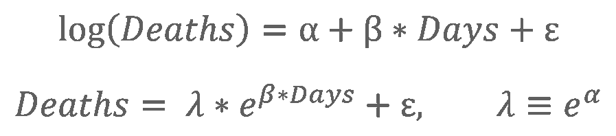

All analyses tracking the regional spread of coronavirus must define a starting point, when a certain early condition triggers the forward measurement of time. That starting point cannot be as simple as the first confirmed COVID case, firstly because testing in the early stage of an outbreak is sparse, and secondly because the progression of the first few infections is tied to the randomness of individuals’ daily interactions.

In New York state, coronavirus [may have arrived more than one month before the first confirmed case](https://www.cdc.gov/mmwr/volumes/69/wr/mm6922e1.htm?s_cid=mm6922e1_w) on March 1, 2020. There, fatalities soared from 1 to nearly 500 in two weeks. Conversely, the Norfolk-Newport News area of Virginia had still not witnessed ten deaths 30 days after its first.

To account for this early-stage uncertainty, while attempting to model the disease's growth in later stages, COVID data analysts measure its growth from a constant threshold of initial cases (or deaths). These chosen thresholds reflect the notion that COVID proceeds to grow in a semi-predictable manner once a **critical mass** has been surpassed.

Different modelers will choose different thresholds. The *[Financial Times](https://ig.ft.com/coronavirus-chart/?areas=usa&areas=gbr&cumulative=0&logScale=1&perMillion=0&values=deaths)* measures new cases or deaths by country from the day 10 cases/day or 3 deaths/day is reached, and cumulative cases/deaths from the day of the 100th case/death. The [data visualization at 91-divoc.com](http://91-divoc.com/pages/covid-visualization/) measures cases by country from the day of the 100th case and deaths from the day of the 10th death; for regions, it uses 20 cases or 5 deaths, respectively; for *per capita* figures, it uses 1 case or death per 1 million people. These amounts correspond with the lower bound of the x-axis on time series graphs.

## What critical mass threshold makes the most sense at a regional level?

Here we examine the [Johns Hopkins CSSE time series dataset](https://github.com/CSSEGISandData/COVID-19/tree/master/csse_covid_19_data/csse_covid_19_time_series) to determine for ourselves (using data up to 5/31/20). We choose to analyze counts of confirmed COVID fatalities, which are more reliable early-stage figures than confirmed COVID cases. (However, deaths are a lagging indicator, and the concept of *critical mass* really pertains to infections.)

First, we group U.S. county-level COVID death counts into the top 100 Census Bureau metropolitan statistical areas (MSAs), which adhere to county boundaries.

Next, we shift the daily figures for each MSA to synchronize the two weeks before and two weeks after the day *X* total deaths were observed, where *X* = 1, 2, 5, 10, 20, 50, 100, 200, 500, 1000, and 2000. (Why these amounts? Contagions spread exponentially, and these numbers break the span from 1 to 2000 into roughly equal logarithmic intervals. As of today, only two MSAs have reached 50,000 total deaths.)

Then, for each level of *X*, we create linear regressions for the two weeks before and two weeks after, based on the logarithmic formulae below:

Below, see interactive graphs for *X* = 1 and 2 deaths.

The paths on the right side of these two graphs are extremely divergent, signifying that these small thresholds are too early in the spread of coronavirus to make a meaningful prediction or comparison of the future.