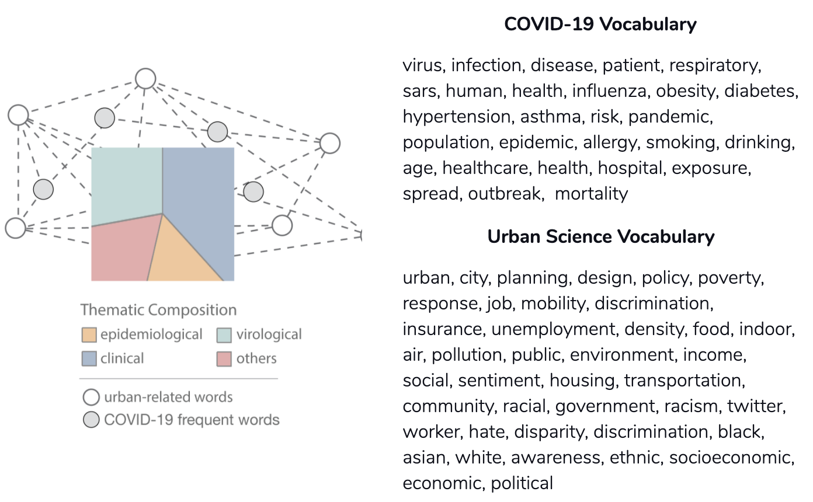
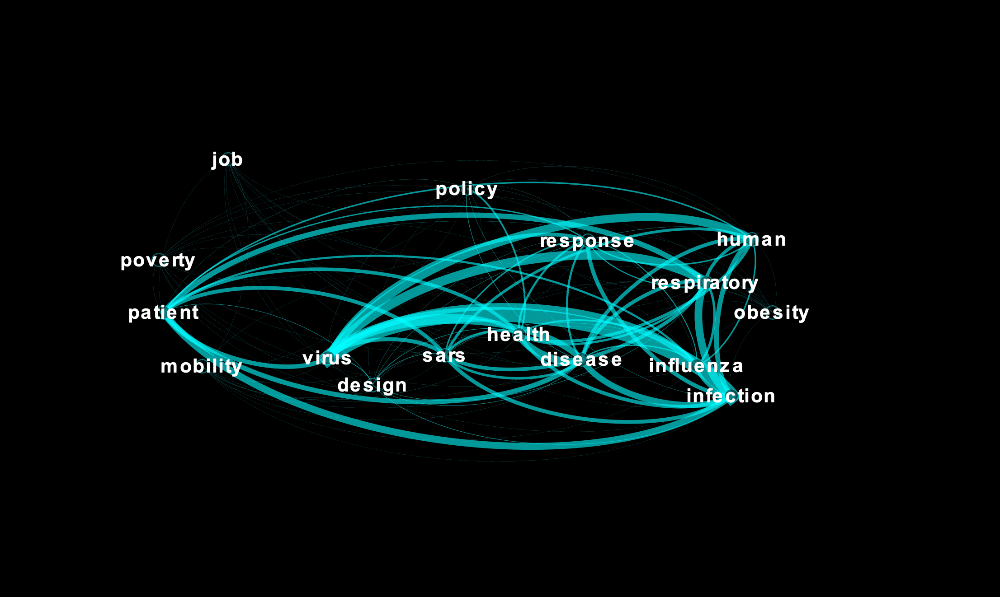
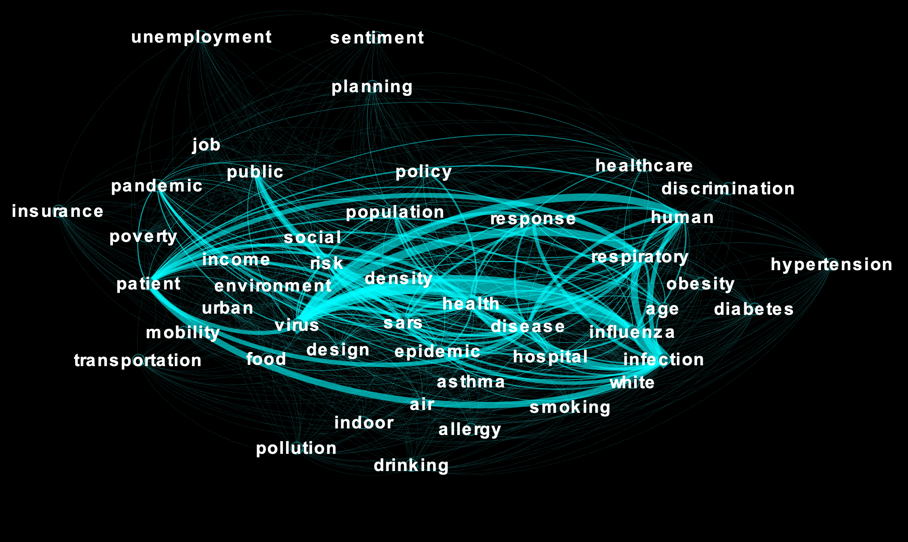
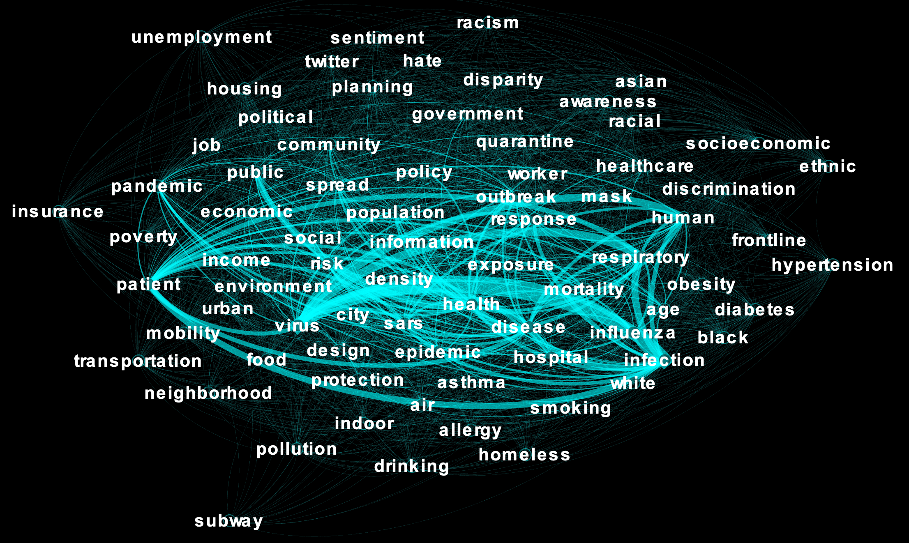

My [previous blog post](https://blog.civicdatadesignlab.mit.edu/unpacking-covid-19-publication-research-themes-and-urban-indications-(part-i)) explored [COVID-19 AI OPEN Research Dataset Challenge](https://www.kaggle.com/allen-institute-for-ai/CORD-19-research-challenge) manuscript data and topic modeling technique for thematic structure discovery. This exploratory data analysis (EDA) identified three major themes: epidemiology, virology, clinical studies, and unidentified topics. Using this output, we built a [dashboard](https://public.tableau.com/profile/yuan5273#!/vizhome/COVID-19OpenResearchViz/Dashboard1) to visualize manuscripts grouped by country with the quantified thematic composition (in percentage) for exploring scientific research. The topic modeling results revealed several insights: of all the manuscripts, 36% were related to “clinical” studies (looking for a treatment), 27% to “virological” studies (understanding the biology of the virus), 19% to “epidemiological” studies (understanding the spread of the virus), and 18% to other research studies

Quantifying and visualizing the current COVID-19 research landscape is interesting, but how does it reflect non-clinical factors and intersect with urban science? To explore this question, we used cleaned abstract text data to further analyze the co-occurrence of keywords that are relevant to urban science. The formation of this keyword dictionary proceeds in two steps. First, we examined the top words ranked by their appearance in the abstracts of every paper. These words are the most common terms that are related to identified themes. Because “epidemiological” studies relate most to urban science and that urban science may represent a small portion of the entire COVID-19 research scope, we then added urban-related vocabulary into the dictionary, such as “planning”, “housing”, “socioeconomic”, and “transportation”. By analyzing the inter-correlation between these two groups of words, we may understand how urban-related terms appear in scientific research manuscripts and underlying interconnections between health and urban factors.

With this dictionary, we then used network analysis to investigate how these terms are connected. The concept of text network analysis derives from graph theory. By associating pairs of words based on their co-appearance in a text file, network visualizations reveal complex structures and underlying patterns. Computationally, we used Sklearn in Python to convert the cleaned corpus (from Part I) into a matrix of token counts. The first output is aNbyNmatrix, where N is the number of unique vocabulary extracted from all texts. Because this matrix will be huge when analyzing thousands of abstracts a subset was extracted which represents the matrix related to the defined dictionary for the final graph visualization.

Now let’s look into this graph step-by-step based on the rendering completeness of graph representation. In general, graph rendering with lower completeness highlights a fundamental structure of the graph. Increasing rendering completeness extends the network complexity by including more nuanced nodes and edges. The weight of an edge, visualized as the width, indicates the prevalence of co-occurrence between any two terms. A graph with 20% completeness reveals core connections (or research interests) focusing on infection and patient, as well as some clinical and epidemiological research compared to “SARS” and “Influenza.” Multiple urban-related terms are included here, such as “poverty”, “job”, “mobility”, and “policy”. Some terms such as design and response, may carry different urban or clinical meanings depending on specific context.

The graph with 60% completeness shows how different health conditions relate to other health, behavioral, socioeconomic, and policy factors. Some additional words indicate socioeconomic vulnerability, such as “social, “income,” “job,” “insurance,” and “unemployment “Asthma,” one of the top respiratory pre-existing conditions, is associated with indoor living quality, air pollution, and insurance status. “Obesity,” as another comorbidity found in COVID-19 patients, is associated with “drinking,” “unemployment,” “poverty,” and “mobility.”

The graph with 100% completeness reveals broader racial disparities and racism during this pandemic. [A recent interview with public health specialist and physician Camara Phyllis Jones](https://www.scientificamerican.com/article/why-racism-not-race-is-a-risk-factor-for-dying-of-covid-191/) revealed that occupations, communities, and health care leave people of color, especially Black Americans, more exposed and less protected. The data visualizations we produced resonate with her insights on systemic racism and its impact on almost every aspect of peoples’ lives. The words“neighborhood,” “environment,” “hospital,” “government “mobility,” “planning,” and “design” imply inequities in community resources and living conditions. Others imply population health disparities, especially in pre-existing conditions such as “obesity,” “diabetes,” and “asthma.” The Asian population, on the other hand, is associated explicitly with [racial discimination, negative sentiments on social media, and hate crimes](https://items.ssrc.org/covid-19-and-the-social-sciences/the-rise-of-anti-asian-hate-in-the-wake-of-covid-19/). This indicates that people of color in different ethnic groups may face different discimination and injustice. Additional words may look nuanced in the entire graph, but represent specific population groups, such as “homeless” and frontline” workers.

While the goal of this study was to unpack the complex research landscape, there are limitations when considering data sources as a collection of scientific research manuscripts. This partially explains why we see relatively weak links among the terms representing social, economic, demographic, and political factors. To some extent, we suspect that broader social science studies on COVID-19 may be underrepresented in the original pool of manuscripts and preprints. Novel information mining, data analytics, and knowledge discovery methods are needed for more in-depth investigation for more comprehensive understandings in this pandemic.

In conclusion, this project used Natural Language Processing and topic modeling to identify the underlying thematic structure based on approximate 47,731 manuscripts. Network analysis and visualization of keywords further revealed the intertwined virological, clinical, and epidemiological complexities involving the spread, infection, and mortality of this infectious disease. Using text mining and graph theory, we built a network of critical terms that are relevant to both this pandemic and urban science. During this pandemic, while different groups of people may face different hardships and threats, the underlying network structure and patterns of academic manuscripts reveal prevalent inequalities and injustice that contribute to disease vulnerability and exposure risks.

**References**

Brainard, J., 2020. New tools aim to tame pandemic paper tsunami.Science. Available: <https://science.sciencemag.org/content/368/6494/924/tab-pdf>

Feagin, J. and Bennefield, Z., 2014. Systemic racism and US health care.Social science & medicine, 103, pp.7-14.

Gray, D.M., Anyane-Yeboa, A., Balzora, S., Issaka, R.B. and May, F.P., 2020. COVID-19 and the other pandemic: populations made vulnerable by systemic inequity.Nature Reviews Gastroenterology & Hepatology, pp.1-3.

Hutson, M. 2020. Artificial-intelligence tools aim to tame the coronavirus literature.Nature. Available: <https://www.nature.com/articles/d41586-020-01733-7>

Laster Pirtle, W.N., 2020. Racial capitalism: a fundamental cause of novel coronavirus (COVID-19) pandemic inequities in the United States. Health Education & Behavior, p.1090198120922942.

Lee, J. and Yadav M. 2020. The Rise of Anti-Asian Hate in the Wake of Covid-19. Insights from the Social Sciences. Available: <https://items.ssrc.org/covid-19-and-the-social-sciences/the-rise-of-anti-asian-hate-in-the-wake-of-covid-19/>