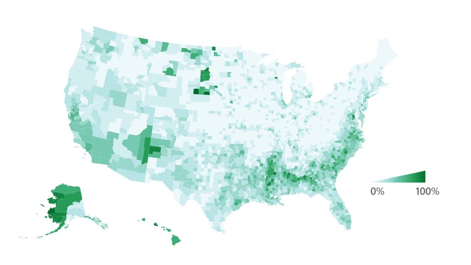

The connection between COVID-19 and the health of the economy is obvious. But, the direct cause & effect relationship is an intricate thing to measure, because it is neither one-dimensional nor unidirectional. The influence of one on the other is distorted with each pass through America's heterogeneous social fabric, like light passing from air to water.

Here are two striking animated maps illustrating this asymmetrical relationship. First is a map representing daily new confirmed coronavirus cases per capita in the U.S. by county from March 1, 2020 to July 6, 2020 (a one-week trailing average to account for regular fluctuations).

*Map 1. Daily new confirmed coronavirus cases per capita (one-week trailing average), United States, 3/1/2020-7/6/2020. Produced with QGIS and Photoshop.*

Here it was important to represent cases in the vertical dimension as well as choropleth fill to highlight counties both large and small.

This second animated map portrays the unemployment rate by county from Feb. 1, 2020 to June 1, 2020. The Bureau of Labor Statistics releases unemployment figures for each month, which we assign to the first day of the following month and approximate linearly for all other days. Preliminary figures for May were released last week. Figures for Puerto Rico are not available for April or May, so the territory was not included here.

*Map 2. Unemployment rate, United States, 2/1/2020-6/1/2020. Produced with QGIS and Photoshop.*

Scrutinize these two maps in close comparison with each other. Their timeframes are off by one month, but they cover the recent surges in each variable. Notice the incredible differences in the regions most affected by coronavirus (and in what order) versus those affected by high unemployment.

Coronavirus cases per capita first peaked in a handful of urban hot-spots (New York, NY; New Orleans, LA; Detroit, MI; Cincinnati, OH; Albany, GA), then spread to an entirely different set of rural hot-spots (the Oklahoma panhandle; Iowa and Southern Minnesota; Northeast Arizona; and several extreme spikes in the Midwest and South), and finally experienced a surge across the entire Sun Belt which is still ongoing.

Unemployment, meanwhile, demonstrated a ubiquitous surge across the entire country, with Las Vegas, NV, and the entirety of Hawai'i and Michigan particularly impacted.

Why do we witness these regional differences, if coronavirus is the clear precursor to the economic crisis? Why do these differences seem to transcend political juridictions? Beginning our inquiry from these maps leads directly to some initial hypotheses.

### Race

*Map 3. Percent non-white population, United States, U.S. Census Bureau. Produced with QGIS.*

Race appears to correlate significantly with the areas experiencing the largest coronavirus surges. The [Black Belt](https://en.wikipedia.org/wiki/Black_Belt_in_the_American_South) in the South and the expansive cluster of Native American reservations in the Four Corners region appear to be sites of large outbreaks. Counties along the U.S.-Mexico land border, where many migrant laborers work often without being reflected in Census figures, have also been sites of outbreaks. Structural inequities in healthcare, workplace conditions/protections, infrastructure, and crisis preparedness almost certainly contributed to the case severity in these regions. These vectors of vulnerability have also contributed to disparities in unemployment, although it is difficult to observe this at the county level. The chart below is from a recent [report](https://www.epi.org/publication/black-workers-covid/) by the Economic Policy Institute covering "two of the most lethal preexisting conditions for coronavirus--racism and economic inquality".

<iframe width="100%" height="460" src="https://www.epi.org?p=197235&view=embed&embed_template=charts_v2013_08_21&embed_date=20200712&onp=193246&utm_source=epi_press&utm_medium=chart_embed&utm_campaign=charts_v2" frameborder="0"></iframe>

### Occupation Type

Intertwined with race, differences in occupation type also serve to distort the economic burden of coronavirus. Manufacturing and front-line service jobs are more exposed to infection, as well as more susceptible to layoffs (due the combination of the shutdowns, thinner profit margins, and looser workplace protections). These dynamics are suspected to be responsible for the unemployment surges in Hawai'i, [Michigan](https://www.brookings.edu/blog/the-avenue/2020/06/04/why-covid-19-hit-michigan-so-hard/), and [Nevada](https://www.npr.org/sections/coronavirus-live-updates/2020/05/28/864398303/the-sheer-volume-is-hard-to-capture-unemployment-in-nevada-soars-to-historic-hig). Differences in occupation type correlate strongly with race, and the same Economic Policy Institute report mentioned above covers how Black workers disproportionately serve in vulnerable industries.

<iframe width="100%" height="460" src="https://www.epi.org?p=193254&view=embed&embed_template=charts_v2013_08_21&embed_date=20200712&onp=193246&utm_source=epi_press&utm_medium=chart_embed&utm_campaign=charts_v2" frameborder="0"></iframe>

### Incarceration

Lastly, the extreme per-capita spikes appearing in rural Arkansas, Iowa, Indiana, Nebraska, Ohio, and Tennessee in the first animated map happen to be in counties home to large prisons.\[links] Coronavirus has posed a profound threat to the incarcerated.

This is only an abbreviated overview of the relationships at play here, and each of them could be the subject of countless studies. Together, they create an impression of a self-sustaining crisis with intricate internal dynamics. The diagram below summarizes our Lab's thoughts on how these pandemic vectors are interdependent. In it we also attempt to show the difficulties in reconciling data of phenomena occuring at different spatial scales: regional and local.

\[framework graphic]