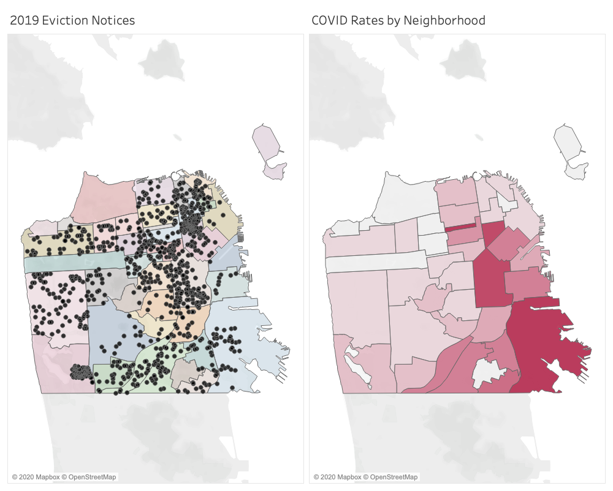
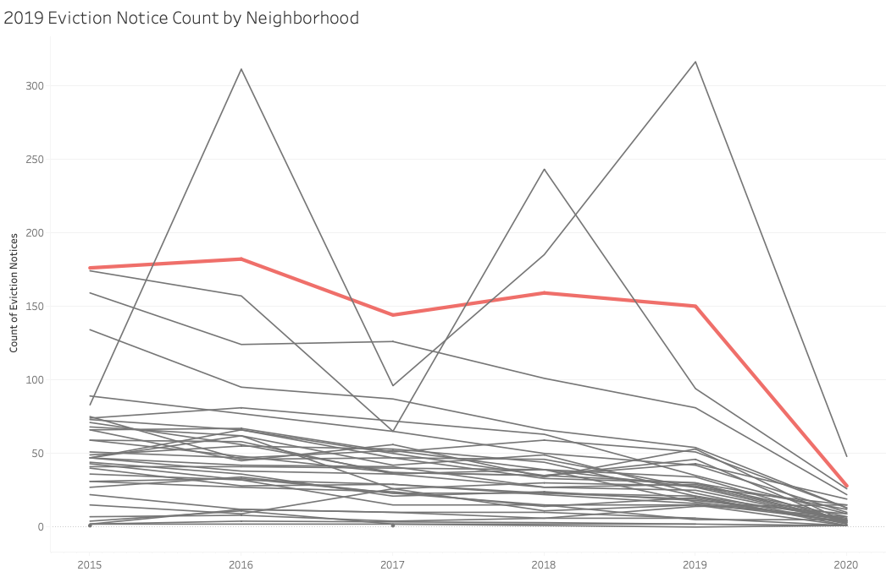
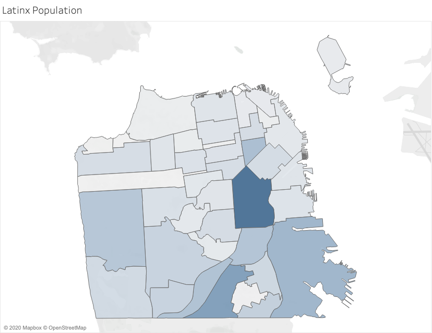

On March 13, 2020, Mayor London Breed issued an executive order temporarily halting most evictions in San Francisco. This moratorium, excluding evictions due to health and safety, is set to expire on July 31. As a result of legislation passed by the Board of Supervisors on June 26, landlords are permanently banned from evicting tenants because of missed rent due to the pandemic. Following the Mayor’s eviction moratorium in March, only 73 eviction notices have been filed through the San Francisco Rent Board, a noticeable decrease compared to the 378 notices filed over the same time period from 2019.

While those official eviction notices have seen a noticeable decrease in numbers, many housing justice groups are predicting [a looming wave of evictions](https://www.nytimes.com/2020/05/27/us/coronavirus-evictions-renters.html) following the expiration of moratoriums across the nation. In many cities, local moratoria and rent freezes have already expired and eviction courts have begun to reopen.

Neighborhoods in San Francisco experiencing historically higher rates of eviction show correlation with some of the same neighborhoods experiencing the highest rates of COVID-19.

\
In particular, 10% of all eviction notices filed in 2019 took place in the Mission (highlighted in pink below), a neighborhood with historically higher rates of eviction. The Mission also currently has one of the highest COVID rates in San Francisco.

Perhaps this statistic is unsurprising: lower-income and economically vulnerable communities have been independently found to have higher risks towards both COVID and eviction.

However, eviction rates are only the tip of the iceberg in a city’s housing landscape. Displacement of cost-burdened residents, landlords incentivized to flip affordable housing, and neighborhoods undergoing rapid gentrification— already difficult phenomena to quantify—are further left out of COVID-19 related housing data. In San Francisco, the Hispanic and Latinx community alone makes up 50% of all COVID-19 cases, despite making up only 15% of the population. Furthermore, this community is most densely concentrated within the Mission.

Drawing correlations between eviction, racial demographics, and COVID rates across San Francisco raises important questions surrounding current and predicted patterns of displacement. Current eviction rates cannot fully represent who may be unable to pay rent, who is being illegally evicted, or who may be subject to eviction after the moratorium expires. There are many factors to the structural racism and pre-existing conditions that the city ascribes to COVID risk so we can’t immediately map a single factor to COVID cases. Understanding the inability of eviction data to fully tell the story of San Franciscans facing housing injustice during this pandemic is only the first step in unpacking these correlations.