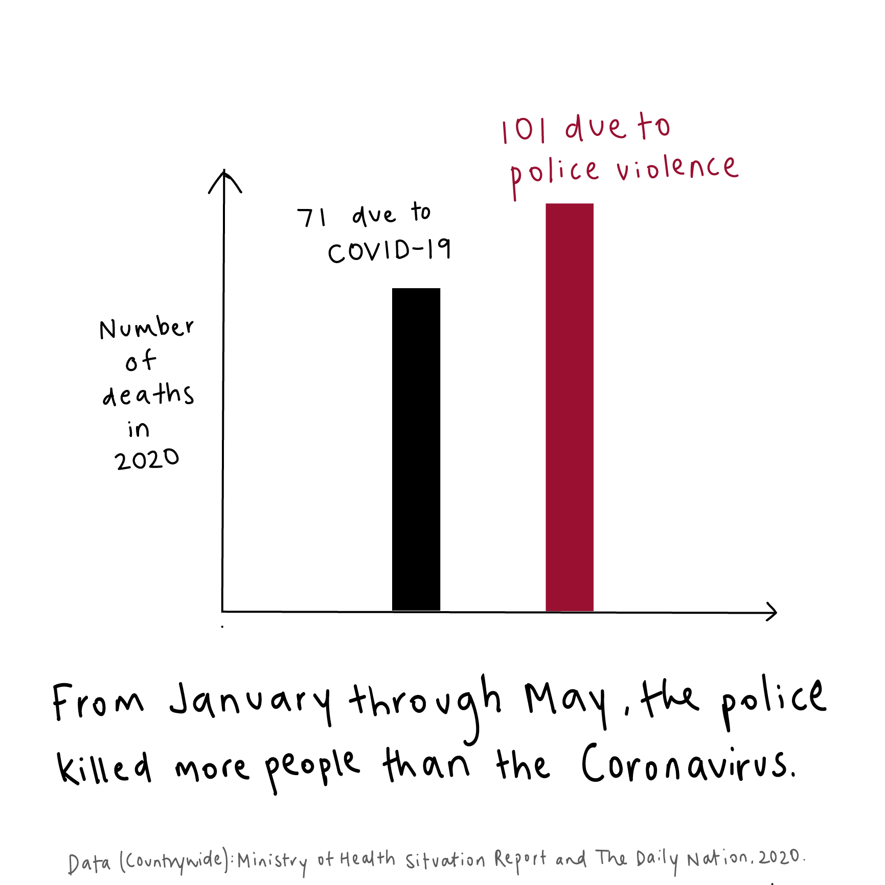
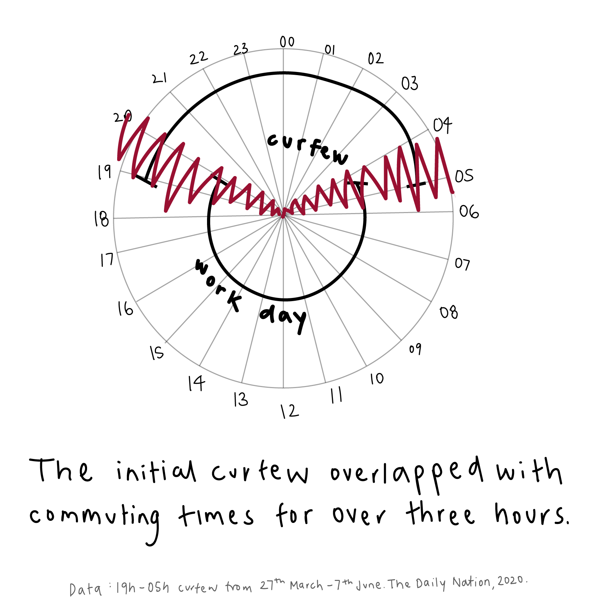
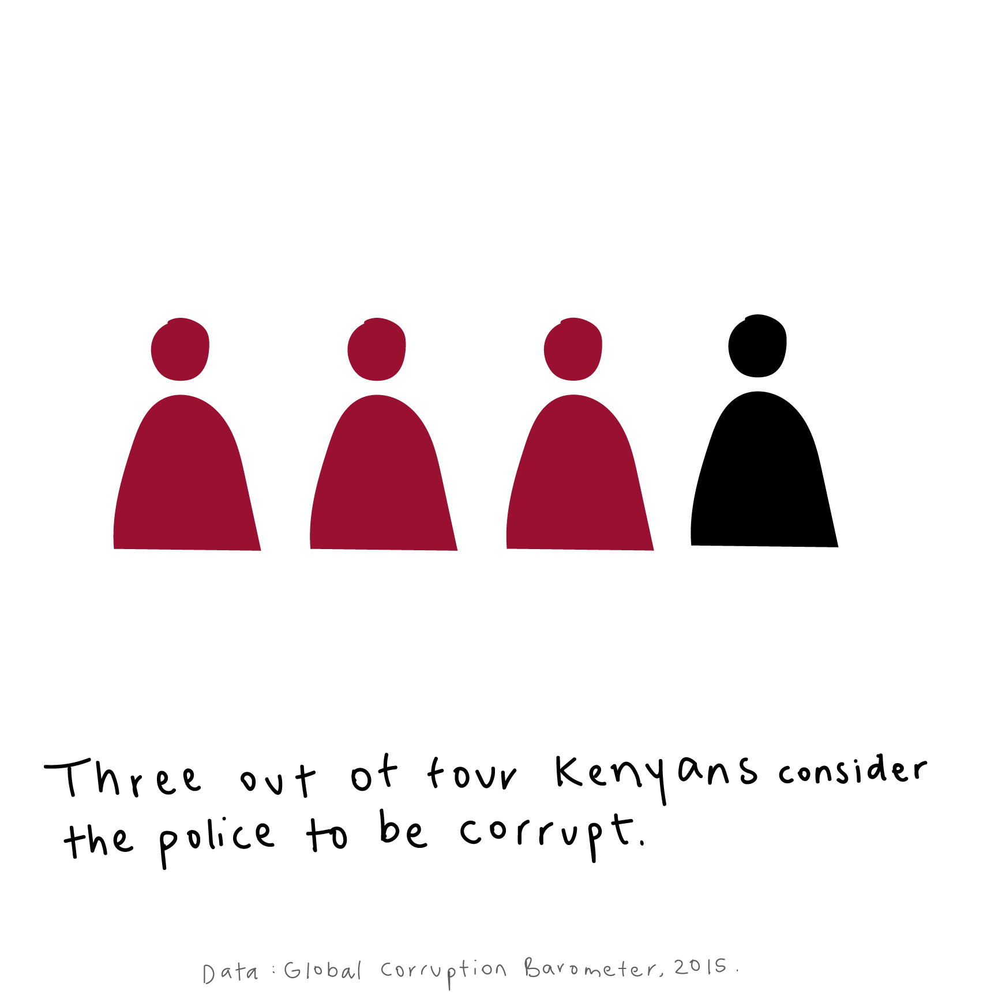
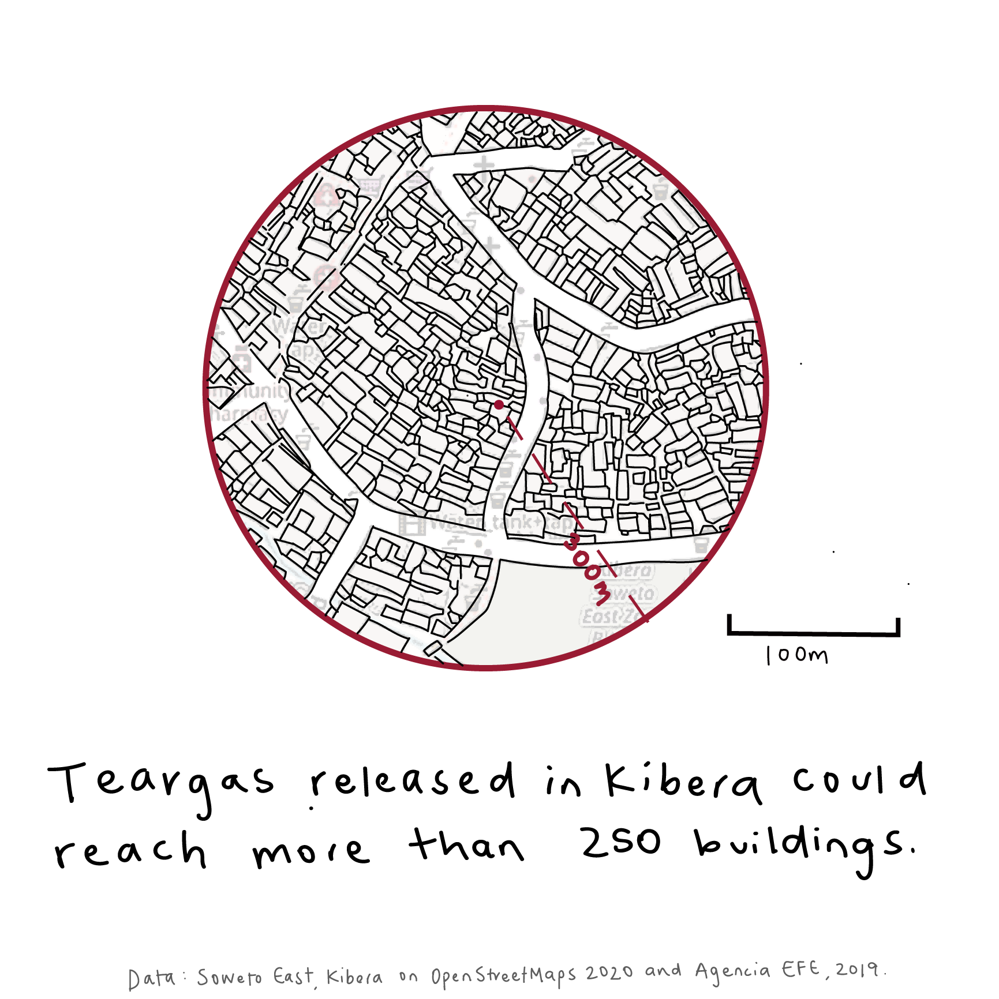

On the first of June, Vox released an article called “The anger behind the protests, explained in 4 charts”.In the article, Sean Collins uses data visualizations to explain the landscape of police violence in the United States, a structural issue that has come to the surface most recently due to the murder of George Floyd on the 25th of May. In the article, the author states “protests have continued night after night because they are not just about that single killing but what it represents: rampant police brutality that seems to have no consequences” (Collins 2020). Reading this article got me thinking about the parallels in one of my homes, Nairobi, Kenya, where recent protests have mirrored those happening in the United States.

This article explores the anger behind the protests in Nairobi, looking into some of the dynamics of police violence through four charts. You will notice that this story looks quite a bit different to the sleek digital visualizations that we create at the CDDL. I have always been amazed by data humanism, particularly the hand-drawn visualizations of Mona Chalabi and Giorgia Lupi, and my hope is that the hand drawn charts convey both the urgency of the situation and its deeply human impact.

On the 8th of June in Mathare, one of Nairobi’s informal settlements, over 200 protesters marched with signs reading “Stop Killer Cops” and “Our Lives Matter”, and images of mothers of victims of police violence kneeling in front of Mathare Social Justice Centre draw scary parallels to what is going on in the United States. While many people in the United States see the coronavirus and police violence protests as separate crises, in Nairobi the two crises and their responses have been deeply entwined.

**Where Coronavirus and Police Violence Collide**

The Kenyan government was quick to respond to the Coronavirus outbreak, implementing a lockdown and strict curfew starting from 27th March 2020. This curfew has been enforced intensely and with violence in many forms. At police checkpoints strategically placed on many roads key to people's daily commutes between the center city and its outskirts, workers were met with violence:

*Thousands joined long queues at bus stations that extended beyond the 7pm cut-off time as matatus – observing new guidelines – were ferrying at about 50 per cent capacity….As they braved the delays and queues, police officers on the other end were arming themselves with clubs and whips – generally preparing themselves for violence (in Daily Nation 2020).*

Tear gas was employed to dispel crowds and protesters both in Nairobi and Mombasa. In addition, state actors carrying out forced evictions in Kariobangi settlement have left 5,000 citizens newly homeless and at higher risk for contracting COVID-19 (Bhalla 2020). Then, we began to hear how citizens accused of breaking curfew were beaten and killed. Over 15 people were murdered by police since the start of the curfew, including 13-year-old boy Yassin Hussein Moyo, who was shot by a police bullet while standing on his apartment balcony in late March. As the Nation reports, “the indiscriminate violence on men, women and children was shocking in its brutality and complete disregard for liberties” (Daily Nation 2020). #NoJusticeNoPeace and #ICan’tBreathe were themes that arose in Nairobi too, and activist groups including the Mathare Social Justice Centre have led protests to bring these issues to a national and global view.

**The Graphics**

One

“They have killed us more than corona,” a protester from the 8th June in Mathare, said simply. This straightforward quote inspired the first graphic. As of the end of May, the statistics showed that 101 people had been killed by police and 71 people killed by COVID-19. As we move past the initial curfew, the COVID-19 cases have risen rapidly to overtake this number, however police murder persists.

Two

The initial curfew went from 7pm to 5am, with some reports of police enforcement of the curfew even before the clock hit seven. The example I have taken is the work schedule of a matatu driver or housekeeper who, like many workers across the city, leaves before dawn and works until late because they must commute multiple hours a day in Nairobi traffic. This leaves more than three hours where workers traveling to and from their workplaces were vulnerable to severe violence and at times murder at the hands of the police. As of the 7th of June, the curfew has since been extended 21 days but relaxed to 9pm to 4am, allowing more time for free movement.

Three

According to GAN Business Anti-Corruption portal, three out of four Kenyans consider most or all police officers as corrupt (GCB 2015). This graphic points to larger issues with police conduct in Nairobi: these include ubiquitous bribery, extortion especially of Somalis, and brutality toward often innocent citizens. Corrupt police officers are rarely arrested or prosecuted for corruption crimes (HRR 2016).

Four

Police conduct goes further than the reach of their hand. This last visualization is a result of my inner urban planner. Something that we often forget about is how the use of teargas can have a magnified effect on high-density residential areas including informal communities like Kibera settlement in Nairobi. If teargas is released in Kibera, its 300m radius means that the teargas could reach more than 300 buildings, compromising the health of countless residents of the areas surrounding the location where the teargas was released.

**What This Means**

It is my hope that the graphics, along with the articles quoted, speak for themselves. However, in closing, it is important to emphasize that the situation reveals to us unlikely parallels in police brutality between the United States and Kenya. It shows us the global nature of this issue, and how police were created to support existing power structures rooted in colonialism and white supremacy. This situation is also a call for urgent innovation in Coronavirus prevention. Informal settlements, often highly dense, are doubly vulnerable- not only to the disease but also to the loss of income resulting from curfews. In the United States and in Kenya, we need to start thinking of prevention measures that protect both people's livelihoods and their lives.

You can read more about police brutality in Kenya at Mathare Social Justice Centre, Kenyan newspaper The Daily Nation, Citizen TV, and through Human Rights Watch.

**References**

* Bhalla, Nita. “Forced Evictions Leave 5,000 Kenyan Slum Dwellers at Risk of Coronavirus.”Reuters, Thomson Reuters, 6 May 2020,[www.reuters.com/article/us-health-coronavirus-kenya-homelessness/forced-evictions-leave-5000-kenyan-slum-dwellers-at-risk-of-coronavirus-idUSKBN22I1VC](http://www.reuters.com/article/us-health-coronavirus-kenya-homelessness/forced-evictions-leave-5000-kenyan-slum-dwellers-at-risk-of-coronavirus-idUSKBN22I1VC).
* Collins, Sean. “The Anger behind the Protests, Explained in 4 Charts.”Vox, Vox, 31 May 2020,[www.vox.com/2020/5/31/21276004/anger-police-killing-george-floyd-protests](http://www.vox.com/2020/5/31/21276004/anger-police-killing-george-floyd-protests).
* Gan Integrity. “Kenya Corruption Report.”GAN Integrity, 11 June 2020,[www.ganintegrity.com/portal/country-profiles/kenya/](http://www.ganintegrity.com/portal/country-profiles/kenya/).
* Kahura, Dauti. “Saba Saba At 30: The Gains We Have Lost.”The Elephant, 7 July 2020,[www.theelephant.info/features/2020/07/07/saba-saba-at-30-the-gains-we-have-lost/](http://www.theelephant.info/features/2020/07/07/saba-saba-at-30-the-gains-we-have-lost/).
* Kenya Ministry of Health. 2020,Covid-19 Outbreak in Kenya - Situation Report No. 77,[www.health.go.ke/wp-content/uploads/2020/06/Kenya-COVID-19-SITREP-077-02-Jun-2020.pdf](http://www.health.go.ke/wp-content/uploads/2020/06/Kenya-COVID-19-SITREP-077-02-Jun-2020.pdf).
* Santiago, Maria M. Mur. “Living with Tear Gas, the Other Face of Chile's Protests.”Www.efe.com, 17 Nov. 2019,[www.efe.com/efe/english/portada/living-with-tear-gas-the-other-face-of-chile-s-protests/50000260-4113001](http://www.efe.com/efe/english/portada/living-with-tear-gas-the-other-face-of-chile-s-protests/50000260-4113001).
* Sperber, Amanda. “'They Have Killed Us More than Corona': Kenyans Protest against Police Brutality.”The Guardian, Guardian News and Media, 9 June 2020,[www.theguardian.com/global-development/2020/jun/09/they-have-killed-us-more-than-corona-kenyans-protest-against-police-brutality](http://www.theguardian.com/global-development/2020/jun/09/they-have-killed-us-more-than-corona-kenyans-protest-against-police-brutality).
* The Nation Team Kenyans Brace Brutality as Police Enforce Curfew.”Daily Nation, 30 Mar. 2020,[www.nation.co.ke/kenya/news/kenyans-brace-brutality-as-police-enforce-curfew-282826](http://www.nation.co.ke/kenya/news/kenyans-brace-brutality-as-police-enforce-curfew-282826).
* United Nations High Commissioner for Refugees. “Kenya: Information on the July 1990 Riots.”Refworld,[www.refworld.org/docid/3ae6aac02c.html](http://www.refworld.org/docid/3ae6aac02c.html).
* Wambui, Mary. “Police Disrupt Saba Saba Protests in the City.”Daily Nation, 7 July 2020,[www.nation.co.ke/kenya/news/politics/police-disrupt-saba-saba-protests-in-the-city-1446314](http://www.nation.co.ke/kenya/news/politics/police-disrupt-saba-saba-protests-in-the-city-1446314).

**Update from the 7th of July 2020**

On the seventh of July, another protest took place in Nairobi’s Central Business District. Kenyans took to the street in the Saba Saba protests against human rights violations in the country. Saba Saba (seven seven in Kiswahili) refers to the 1990 pro-democracy demonstrations held throughout Kenya. At the time, over 6,000 people demonstrated against the detention of two cabinet ministers without trial, which reflected a larger blockage of political voice for citizens. The demonstrations called for the restoration of the multiparty system after leaders had called for it in May 1990. Then-President Daniel Arap Moi deployed the General Service Unit (GSU, the Kenyan paramilitary police) troops and used violence against protesters, killing over 20 people and leaving 1,000 in jail after the four days of confrontations (The Elephant 2020).

This year’s protests celebrated the 30th anniversary of Saba Saba, and they came in the wake of recent cases of police violence. Protesters were met with heavy security presence including teargas and arrests. Protesters carried the message against police violence through chants and placards with messages like “Stop Promoting Police Deviance”, “Stop Killer Cops” and “Corruption is as Bad as Colonialism” (The Nation 2020). Over 20 demonstrators were arrested, and the Social Justice Working Group and its community group members continue to organize for sponsoring bail funds and working against police violence in Nairobi.