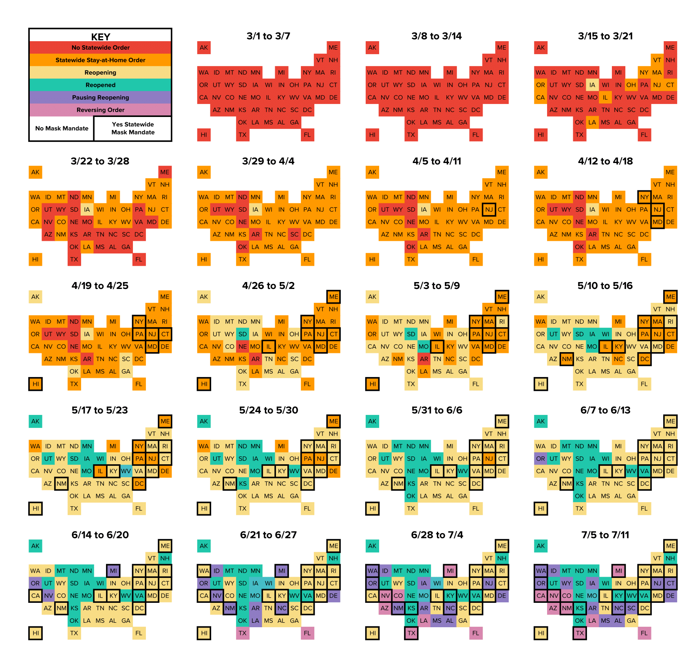
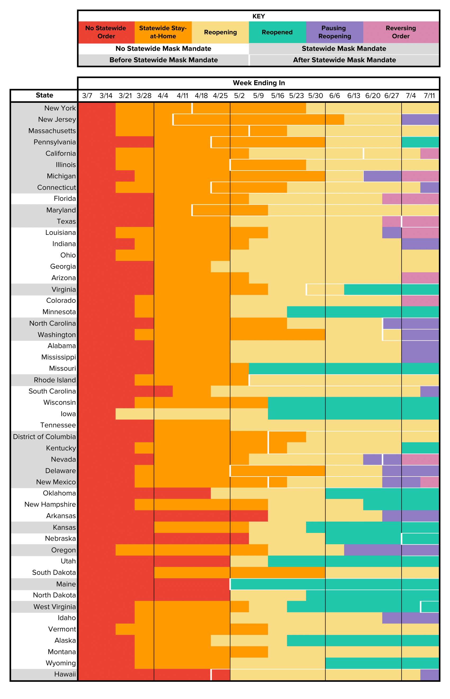
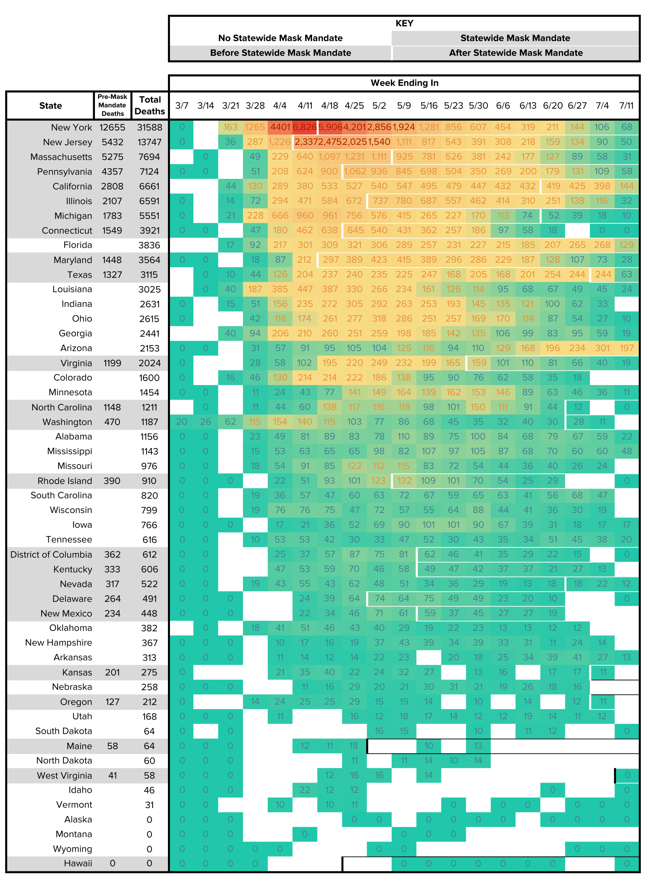
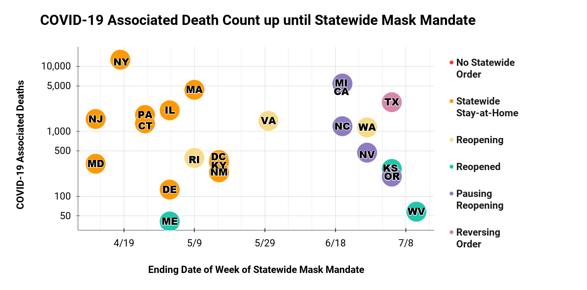

All 50 states have been affected uniquely and have reacted differently to COVID-19. Some have authorized statewide stay-at-home orders, and some have authorized statewide mask mandates, but even these policies vary in both scale and time from state to state. Notable news publications, including the [New York Times](https://www.nytimes.com/interactive/2020/us/states-reopen-map-coronavirus.html) \[1],[CNN](https://www.cnn.com/2020/06/19/us/states-face-mask-coronavirus-trnd/index.html) \[2], and the[Washington Post](https://www.washingtonpost.com/graphics/2020/national/states-reopening-coronavirus-map/) \[3], have created interactive visualizations illustrating these variations in state reopening statuses, consistently updating in real-time to provide the latest information. To add additional insight to these nationwide conversations on reopening, these data visualizations narrate timelines: comparing and contrasting how ever-shifting national guidelines and state case counts have influenced statewide policies over time.

COVID-19 has created an international public health epidemic and, partially due to its shocking novelty, has been met with a variety of uncoordinated responses on the international, national, state, and even county and municipal level. As our collective understanding of the virus increases over time, guidelines, particularly those for preventative measures, have been ever-evolving. For example, although the first case of COVID-19 in the United States was laboratory-confirmed on January 20, 2020 \[5], the Center for Disease Control (CDC), our leading national health authority, did not recommend that everyone wear face coverings around others until the beginning of April \[6, 7]. Until then, it was unconfirmed and unknown that the virus could also be spread by asymptomatic people. In fact, President Trump did not endorse wearing face masks until July 21.

As prominently displayed in the above map, this inevitable lack of clarity around COVID-19 is also reflected in the constant shifting of state reopening policies. By the beginning of June, every state had initiated their reopening plans. By mid-July, **20** states had paused or even reversed upon these original plans. Although individual counties and cities have imposed further restrictions on their residents, these data visualizations look exclusively at reopening policies and mask mandates at the state level.

Although COVID-19 associated death counts can be a rough metric, indicative of where a state stands in successfully combating the virus, it is difficult to completely understand how and why each state makes such decisions. The following data visualizations compare COVID-19 associated death counts with state reopening and mask wearing policies. Despite an interesting graphic, we are incapable of commenting on the level of correlation or causation between these two variables because the spread and control of the virus is a multi-dimensional problem. I chose to look at death counts rather than case counts due to the additional impact and ambiguity of regional differences in testing rates, reporting procedures, and hospital resources. From the [dataset](https://data.cdc.gov/NCHS/Provisional-COVID-19-Death-Counts-by-Week-Ending-D/r8kw-7aab) \[9], blank spaces in the chart data visualization indicate that “One or more data cells have counts between 1–9 and have been suppressed in accordance with NCHS confidentiality standards.”

Thus, from these data visualizations, I draw the following conclusions:

1. Statewide mask mandates do not necessarily align with the stages of a state’s reopening policies. In fact, statewide mask mandates have been initiated when a state has been under a stay-at-home order, while reopening, after being reopened, while pausing reopening, and while reversing reopening.
2. As of June 12th, 24 states have statewide mask mandates. 16 of these states instated their mask mandate within two weeks of their peak (in the case of Texas, their second peak) COVID-19 associated death count.
3. The 12 states with the largest total COVID-19 associated death counts, excluding Florida, have statewide mask mandates, 7 of which were instated while the state was under a stay-at-home order. This aligns with the results of a [New York Times nationwide survey](https://www.nytimes.com/interactive/2020/07/17/upshot/coronavirus-face-mask-map.html?action=click&module=Top%20Stories&pgtype=Homepage) \[10], which qualitatively asked individuals about their mask-wearing preferences, and found that “Places that have experienced a lot of coronavirus, with a few exceptions, show higher-than-usual rates of masking.”

This same article concludes, “In parts of the country without a lot of cases, there are still wide variations in mask use that appear to be driven more by local custom and partisan identification than by specific disease risk. If coronavirus cases end up climbing in those areas, too, masks may start appearing on many more faces.”

As with everything surrounding the collective status of the United States and COVID-19, looking not only at statewide mask mandates but also at statewide reopening policies, we’ll have to see how everything plays out.

## Sources

\[1] Lee, Jasmine C., et al. “See How All 50 States Are Reopening (and Closing Again).” The New York Times, The New York Times, 25 Apr. 2020,[www.nytimes.com/interactive/2020/us/states-reopen-map-coronavirus.html](http://www.nytimes.com/interactive/2020/us/states-reopen-map-coronavirus.html).

\[2] Elassar, Alaa. “This Is Where All 50 States Stand on Reopening.” CNN, Cable News Network, 26 Apr. 2020,[www.cnn.com/interactive/2020/us/states-reopen-coronavirus-trnd/](http://www.cnn.com/interactive/2020/us/states-reopen-coronavirus-trnd/).

\[3] Gerhart, Ann. “Where States Reopened and Cases Spiked after the U.S. Shutdown.” The Washington Post, WP Company, 20 July 2020,[www.washingtonpost.com/graphics/2020/national/states-reopening-coronavirus-map/](http://www.washingtonpost.com/graphics/2020/national/states-reopening-coronavirus-map/).

\[4] Kim, Allen, et al. “These Are the States Requiring People to Wear Masks When out in Public.” CNN, Cable News Network, 22 July 2020,[www.cnn.com/2020/06/19/us/states-face-mask-coronavirus-trnd/index.html](http://www.cnn.com/2020/06/19/us/states-face-mask-coronavirus-trnd/index.html).

\[5] Stokes EK, Zambrano LD, Anderson KN, et al. Coronavirus Disease 2019 Case Surveillance — United States, January 22–May 30, 2020. MMWR Morb Mortal Wkly Rep 2020;69:759–765. DOI:<http://dx.doi.org/10.15585/mmwr.mm6924e2>

\[6] Goodnough, Abby, and Knvul Sheikh. “C.D.C. Weighs Advising Everyone to Wear a Mask.” The New York Times, The New York Times, 31 Mar. 2020,[www.nytimes.com/2020/03/31/health/cdc-masks-coronavirus.html?action=click&module=RelatedLinks&pgtype=Article](http://www.nytimes.com/2020/03/31/health/cdc-masks-coronavirus.html?action=click&module=RelatedLinks&pgtype=Article).

\[7] “Surgeon General Explains Evolution of CDC Face Mask Guidance.” MSNBC, NBCUniversal News Group, 3 Apr. 2020,[www.msnbc.com/msnbc/watch/surgeon-general-explains-evolution-of-cdc-face-mask-guidance-81619013687](http://www.msnbc.com/msnbc/watch/surgeon-general-explains-evolution-of-cdc-face-mask-guidance-81619013687).

\[8] Baker, Peter. “Trump, in a Shift, Endorses Masks and Says Virus Will Get Worse.” The New York Times, The New York Times, 22 July 2020,[www.nytimes.com/2020/07/21/us/politics/trump-coronavirus-masks.html?action=click&module=RelatedLinks&pgtype=Article](http://www.nytimes.com/2020/07/21/us/politics/trump-coronavirus-masks.html?action=click&module=RelatedLinks&pgtype=Article).

\[9] National Center for Health Statistics. “Provisional COVID-19 Death Counts by Week Ending Date and State.” Centers for Disease Control and Prevention, Centers for Disease Control and Prevention, 23 July 2020,[data.cdc.gov/NCHS/Provisional-COVID-19-Death-Counts-by-Week-Ending-D/r8kw-7aab.](https://data.cdc.gov/NCHS/Provisional-COVID-19-Death-Counts-by-Week-Ending-D/r8kw-7aab)

\[10] Katz, Josh, et al. “A Detailed Map of Who Is Wearing Masks in the U.S.” The New York Times, The New York Times, 17 July 2020,[www.nytimes.com/interactive/2020/07/17/upshot/coronavirus-face-mask-map.html?action=click&module=Top%2BStories&pgtype=Homepage](http://www.nytimes.com/interactive/2020/07/17/upshot/coronavirus-face-mask-map.html?action=click&module=Top%2BStories&pgtype=Homepage).