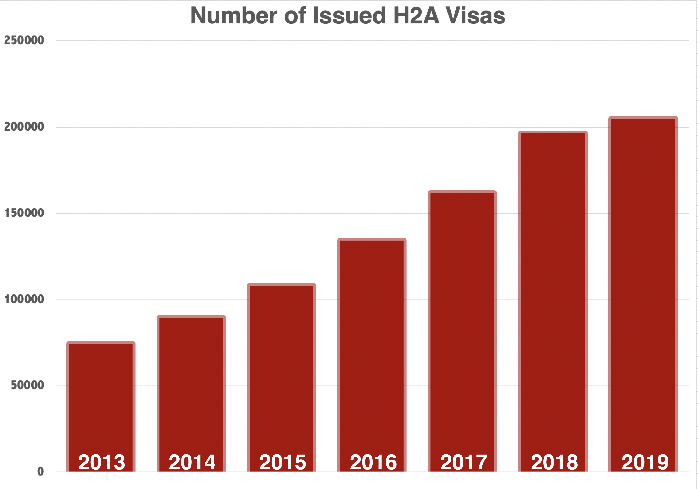
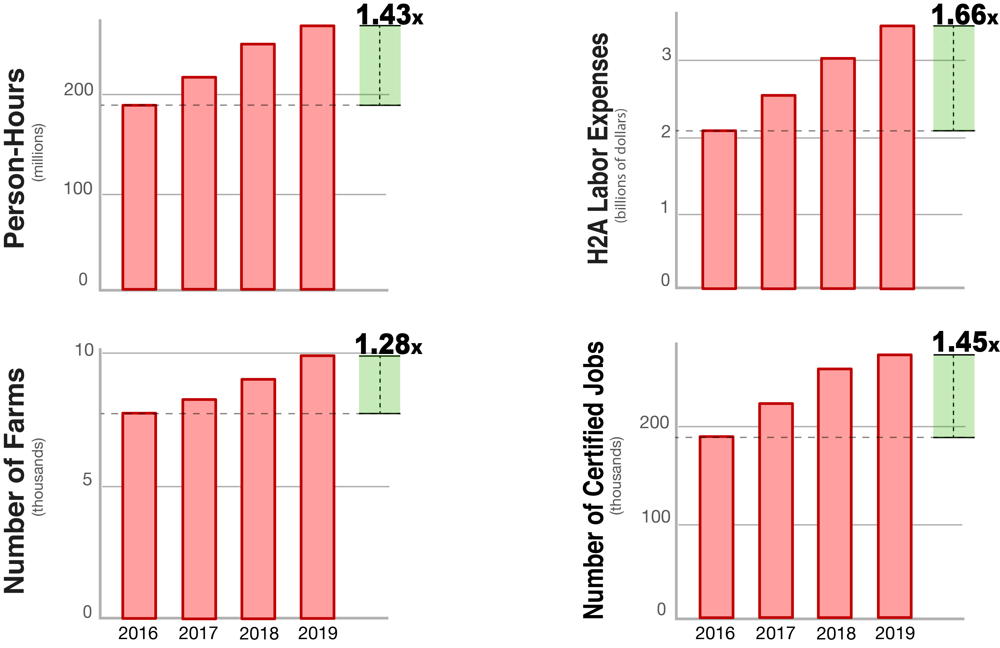

The Mississippi sweet potato planting season recently came to a close. Mike Williamson, a farmer of Williamson Family Farms in Water Valley, Mississippi, only hopes that all he’ll have the workforce to harvest those crops come October.

“I’m not one hundred percent sure that my amigos will be here in the fall. If not, I’ll be out of business,” Williamson said.

The “amigos” he refers to are his farm workers from Mexico, specifically those who were issued H2A visas—one of the only visas that has not been suspended per a [June 22 Presidential Proclamation](https://www.whitehouse.gov/presidential-actions/proclamation-suspending-entry-aliens-present-risk-u-s-labor-market-following-coronavirus-outbreak/) because it is “essential to the food supply chain.”

For the last seven years, Williamson has hired H2A visa workers to plant and harvest his crop. This year, he requested 28 workers, but due to personal fears of COVID-19, only 25 made the trip. Fortunately for Williamson, all of his workers are in the 90% of visa holders who have previously held an H2A visa, which means that their visa processing time was streamlined.

In a pre-pandemic time, H2A visa applicants - 92% of whom are from Mexico - would undergo a personal interview at a US Consulate to get their visa approved. This year, the Department of State gave Consulates the option to [cancel the interview](https://travel.state.gov/content/travel/en/News/visas-news/important-announcement-on-h2-visas.html) for both new and returning visa applicants on March 26.

However, of the 10% of applicants who are new to H2A, up to “forty percent” of applications could be put on hold, according to Todd Miller of Head Honchos LLC, the San Antonio-based “seasonal labor processing work permit specialist” firm hired by Williamson to recruit workers and navigate the complex visa process.

“When the Consulate finally opens up, it’s going to take 100 years to talk to \[applicants] and get them visas,” Miller said with hyperbole.

Because of the lack of interviews, Miller said that if there is anything imperfect about an application, it could be put on hold. However, as he noted, “there is no hard rule that \[applications] have to be held back” because “it depends on the Consulate staff.”

A world with COVID-19 is also presenting financial obstacles for farmers. Allen Robison, an apple and cherry farmer in Chelan, Washington, said that he is taking daily temperatures of his employees and spending “thousands of dollars” to buy masks and other personal protective equipment.

Despite the logistical hurdles and financial expense caused by the pandemic, the US Department of State and farmers across America are making sure that most H2A visa applicants are able to make it to their final destination. Their efforts speak to the fact that the H2A program is increasingly essential to America’s food supply chain.

H2A visa holders carried 9% of the country’s agricultural labor budget in 2019, a number that is up from 6% in 2016 and that has been steadily growing in the past decade.

Created in 1952 (and modified in 1986), the H2A program allows US-based farmers and agricultural firms to hire foreign workers when “there are not sufficient \[American] workers who are able, willing, qualified, and available, and that the employment of aliens will not adversely affect the wages and working conditions of workers similarly employed in the U.S.”

Despite posting the positions in newspapers and on job boards in multiple states, Mike Williamson said that he has not received “a single American application” in the last seven years.

Without an American agriculture workforce, the demand for visa-issued foreign workers has increased but comes at no small expense for farmers. In addition to paying employees their hourly wage, farmers are required to pay for worker housing, which must abide by a strict code, transportation between the farm and the foreign Consulate, and other visa related fees.

Despite the expense, the program has seen a steady rise in the past decade. One decade ago, the US Department of Labor would consistently issue fewer than 75,000 visas each year.Today, that number has nearly tripled with more than 205,000 visas issued in 2019.

Since 2016 (the year when the US DOL began producing data with consistent formatting), the labor costs of the H2A program have increased by 66% due to a rise in the amount of labor being performed and significant increases in the [adverse wage](http://www.mobilefarmware.com/support/wams/aewr/) - a state-by-state minimum wage to ensure that guest worker wages will not depress the wages of domestic workers in similar occupations. In some states, like Washington, the adverse wage has increased by 24% since 2016.

Additionally, while the number of farms participating in H2A increased by 28%, the total person-hours done by H2A workers increased by 43% and the number of certified jobs by 45%, indicating both that new farms began participating in the program and that returning farms required more farm labor.

The use and expense of the H2A program have been steadily increasing, yet most Americans are completely unaware of its existence. Our food is the foundation of our health as individuals and, by extension, our society. Without an understanding of the farm to table process, the American food supply chain and agricultural economy at large becomes less resilient to obstacles… like a pandemic.

Thus, this post is the first of many CDDL posts which will explore the H2A visa program, its value in America’s supply chain, and its[pitfalls](http://www.ruralneighborhoods.org/wp-content/uploads/2014/03/no-way-to-treat-a-guest.pdf)through both data visualizations and extensive interviews to bring our readers and Americans at large a little bit closer to the food they eat.

## H2A, Visually

This [visualization](https://public.tableau.com/profile/evan.denmark#!/vizhome/TheImpactofH2A/Story1?publish=yes) is a Tableau storyboard that highlights some of the basics about the H2A program: where workers are employed by county, which states use the H2A program, and which crops are most affected by H2A.

All of the data used in this graphic come from the US Department of Labor’s Employment and Training Administration’s published dataset on H2A visa applications for the years 2016-2019.

The map,Where do H2A visa workers go?, shows where H2A jobs are being taken in each county in the US. If a county has H2A activity, the size of the circle represents the number of certified H2A jobs in 2019. It is worth noting that this does not show the number of workers going to each county but rather the number of jobs that were given to an H2A visa holder. Although the two may correlate, a single H2A visa holder may have multiple jobs (potentially on the same farm) at different points in the year. Mike Williamson - the Mississippi sweet potato farmer - hires the same 28 workers in May to plant the crop and in September to pick the harvest. For these 28 workers, these are two separate jobs. In the summer months between the jobs, the workers must leave the US.

The second visualization,Which states use H2A?, shows the amount of H2A labor required in each state in 2019. Each visa application contains the job start and end date as well as the expected number of hours worked per week, so this was used to calculate the total number of person-hours required for each state. Interestingly, the top five states - North Carolina, Washington, Florida, California, and Georgia - make up 51% of the entire labor in the country.

Lastly, inWhich crops are affected by H2A?, the size of each bubble corresponds to the number of person-hours spent on a given crop in each state. By default, the visualization shows data for the entire country but the state can be adjusted in the dropdown. On each visa application, a farmer must specify the job function or primary crop for the job. Many farmers often put “General Farm Worker.” However, the most popular crop for H2A visa holders is tobacco, a crop that supports a large industry but also requires intensive manual labor. It is interesting to see that other crops like corn - America’s largest crop by total production - require much less H2A labor because harvesting is aided by machinery and, thus, requires fewer person-hours. Therefore, the number of person-hours dedicated to a particular crop is a function of the size of the industryandhow much individual attention is required for crop production.

Sources

1. U.S. Department of Labor, Employment and Training Administration, “H2A Disclosure Data” for years 2016-2019
2. U.S. Department of State, Bureau of Consular Affairs, “Nonimmigrant Visa Statistics”