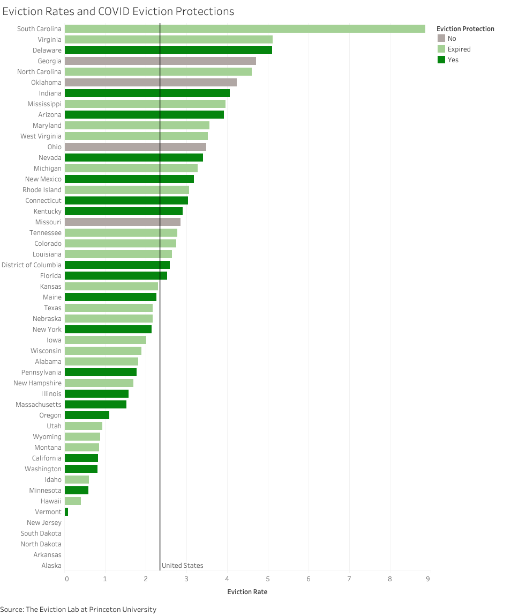

The eviction moratorium under the Federal CARES Act came to an end recently on July 25, and many state-wide eviction protections are quickly following. Many are worried that renters in America could be facing an unprecedented eviction crisis, with some estimating up to [40 million renters](https://www.cnbc.com/2020/07/30/what-its-like-to-be-evicted-during-the-coivd-19-pandemic.html) at risk of eviction once protections end. Described using terms such as “tsunami wave” or “avalanche”, this predicted eviction crisis has been met with varying policies across the country.

Evictions themselves are a public health issue. Like many of the pre-existing inequalities magnified by the COVID-19 pandemic, evictions tend to affect [communities of color](https://thehill.com/blogs/congress-blog/politics/508897-a-wave-of-mass-evictions-is-inevitable-and-black-women-will-be), and often low-income neighborhoods, the most. Furthermore, those threatened with eviction often face [adverse, long-term health outcomes](https://www.bu.edu/sph/2018/10/05/the-hidden-health-crisis-of-eviction/). Evicted tenants also face housing instability that can lead to overcrowded households and homelessness, all which put people at greater risk of COVID-19.

The graph below ranks each state by eviction rate (the number of evictions per 100 rental homes in 2016) and colors each state based on the status of their COVID eviction protection policies. The word “protections” emphasizes the differences in policy strength between legislations. Some states have true eviction moratoriums with a grace period for rent payment, some only prevent new eviction filings, while others only have orders to prioritize essential court proceedings. I’ve limited the scope of housing policies in this visualization to those that explicitly protect tenants from eviction and are executed state-wide. The pale green color indicates whether or not these policies have expired as of July 31, 2020. The last five states in the graph had no available eviction rates.

What is first noticeable about this graph is the sheer number of states with expired eviction protections. As of July 31, only 20 states had existing eviction protections. Of the states with no available eviction rate data, only New Jersey currently has eviction protections; North Dakota and Alaska protections have expired, while South Dakota and Arkansas did not have state-wide protections. The constant line represents the 2.34% eviction rate of the United States in 2016. Interestingly, the four states with no state-wide COVID eviction protections all have higher rates than the national average.

How long do these protections last? This next visualization examines the timeline during which these eviction protections exist. The color of each date represents the number of states with eviction protections in place on that date.

On March 13, Massachusetts and North Carolina became the first states to enact eviction-related policies. A month later on April 13, all 44 states with eviction protections had enacted them. We can see states begin to pass eviction protections most rapidly during the third week of March, with many of the executive orders announcing states of emergencies signed by governors during this week including these housing protections. Gradually, we can see these protections begin to expire. When the CARES Act eviction moratorium expired on July 25, there were 23 states with ongoing protections. Four states (Delaware, Kentucky, New Jersey, and New Mexico) have protections that expire with their state’s state of emergency orders, rather than at the end of a given duration.

While it is difficult to judge the effectiveness of these policies on duration alone, observing the majority of these protections end throughout the summer could offer an explanation to the coming eviction wave that many predict. The average duration of an eviction protection policy among states is 94 days. At the end of June, around half of the states had remaining eviction protections, while the national unemployment rates remained around 11%.

Some of the current policies include a grace period to pay back missed rent, but none offer rent forgiveness. Based on unemployment statistics and the Census Bureau’s [Household Pulse Survey](https://www.census.gov/programs-surveys/household-pulse-survey.html), researchers have created projections on what the [coming month of evictions](https://www.cnbc.com/2020/07/27/how-the-eviction-crisis-will-impact-each-state.html?__source=twitter%7Cmain) could look like for renters across the country, with some states predicted to be hit harder than others. It is worth noting that eviction protections also differ across counties and cities. This leaves tenants navigating a patchwork of protections with various strengths and expiration dates.

As these state-wide eviction moratoriums expire, some are questioning where the responsibility for protecting tenants lies. Many believe that it is up to Congress to enact stronger, [nation-wide eviction moratoriums](https://www.nytimes.com/2020/07/23/opinion/coronavirus-evictions-rent.html), while reports of [illegal self-help evictions](https://www.latimes.com/homeless-housing/story/2020-06-18/despite-protections-landlords-attempting-to-evict-tenants-in-south-l-a-black-and-latino-neighborhoods-data-shows) are leading tenants and activist groups to defend themselves. Like many other COVID-19 related policies, such as mask mandates and economic reopening, housing protections across the country do not often align in timing, strength, or jurisdiction.

In this case, we might not see the effects of these eviction protections for many months, as courts gradually reopen and summons proceed. For more information on how specific cities are witnessing evictions during the pandemic, check out the [COVID-19 Eviction Tracking tool](https://evictionlab.org/eviction-tracking/) created by Princeton’s Eviction Lab.