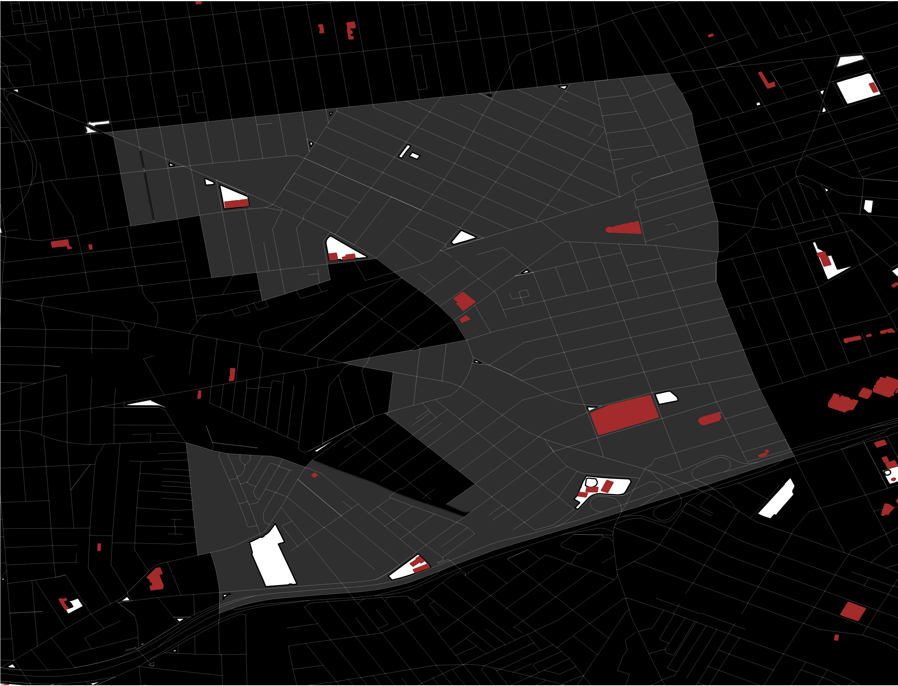
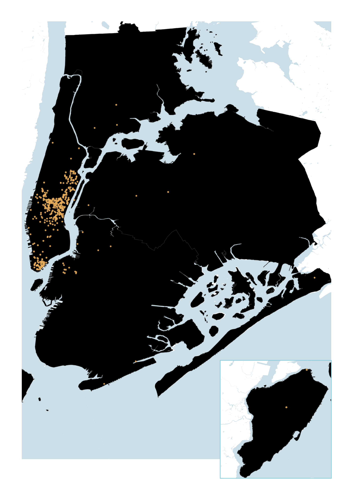
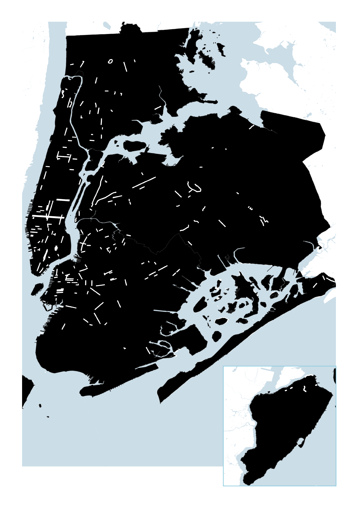

Access to open space is an urban luxury. The urban makeup prioritizes buildings rather than vast, green space in order to ensure density. But during a worldwide pandemic with shelter-in-place mandates and business closures, access to open space is a necessity for public health.

By early April, 45 states in the U.S. had [stay-at-home orders](https://www.nbcnews.com/health/health-news/here-are-stay-home-orders-across-country-n1168736) of varying degrees. Streets emptied, public transportation ridership decreased, and overall traffic disappeared revealing smog-less skies. The activity-void landscape from afar gave people, especially urbanists, the opportunity to rethink urban life and envision [car-less, walkable cities](https://www.nytimes.com/2020/07/09/opinion/sunday/ban-cars-manhattan-cities.html). Streets became the center of attention and a canvas for new, urgent ideas. But on the ground, there were people in desperate need of space -- to walk socially distant from strangers, to exercise, and to be. And in June, Black Lives Matter movements and protests against racism and police violence filling up the empty streets brought a crucial point into the conversation: equity.

Inequitable distribution of parks and public space is not news. "The average park size is 6.4 acres in poor neighborhoods, compared with 14 acres in wealthy neighborhoods, according to an analysis by the [Trust for Public Land.](https://www.nytimes.com/2020/07/15/nyregion/nyc-parks-access-governors-island.html)" This post uses quantitative and qualitative data to show how open space in NYC fared during the pandemic.

**How much space is open in NYC?**

\
New York City, on a pre-pandemic day, would have approximately 33,630 acres of open space, which is around 16% of total city land. Streets are considered as open spaces as well, adding 8137 miles. What counts as open space in this map:

* Parks operated by Department of Parks and Recreation
* Recreational Areas not designated as NYC Parks
* Department of Transportation Pedestrian Plazas
* Cemeteries
* Streets

I use figure ground maps, which are used to show the relationship between the built environment and open space, to illustrate which spaces were open or closed and how openness evolved during the course of the past few months.

#### How much was closed in April?

Effective at 8pm on Sunday, March 22, all non-essential businesses in New York state were ordered to close along with parks with any recreational features such as playgrounds, basketball courts, and beaches. Cemeteries remained open, but closed to visitors. This meant around 30% of NYC’s open spaces were not accessible--this equates to around 12 Central Parks being closed. These closed spaces are marked red in the above map.

When Covid-19 hospitalization rates were at its [peak](https://www1.nyc.gov/site/doh/covid/covid-19-data.page) on 3/30 with 6,136 cases in NYC, limiting access to spaces where there are chances of people congregating in large numbers was the right move. What this closure strategy surfaced is the existing inequities in open space distribution in NYC.

Even from a quick glance, you can see the unequal distribution of large open spaces, which would enable proper social distancing. Each borough has one or two large parks, such as the Bronx Park and Central Park, but this means the majority of NYC residents rely on small parks in their neighborhoods for walkable open space access. And during a lockdown, with decreased public transportation use, people need safe spaces that they can walk to more than ever.

A [map](https://www.arcgis.com/apps/webappviewer/index.html?id=4d082c62efb44e56b105366fb92335b3&extent=-8287910.233%2C4941135.2385%2C-8185178.8669%2C4998463.0097%2C102100) from the Trust for Public Land shows park needs in NYC during the summer of 2020, determined by access to an open park within a ten-minute walk of home. Using this map, I zoomed into a neighborhood that has a high need for parks this summer to see what the  Elmhurst in Queens saw a 64% decrease in neighborhood open space in April. 

#### **What about Privately Owned Public Spaces(POPS)?**

POPS is an important (and [controversial](https://www.nytimes.com/2017/04/19/nyregion/public-space-trump-tower.html)) addition to public space in NYC, with the first initiatives dating to the 1960s. Some are plazas in front of buildings like the Seagram building and some are parks with green space such as the Domino Park in Williamsburg. POPS are a way for the city to create more public space within private development. The map shows that the majority distribution is in Manhattan, in areas with already walkable access to Central Park or Bryant Park. It was also unclear what was open during the lockdown because unlike city parks, there was no easy way to find information about whether they were open.

**“Open” Streets**

A popular pandemic response to inadequate space for social distancing and outdoor activities is Open Streets. Oakland, Milan, and many other cities have [adopted similar strategies](https://www.archdaily.com/938202/people-to-reclaim-streets-in-milan-in-post-covid-19-vision-of-the-city). Open Streets in NYC are pedestrian-friendly streets that are blocked off by NYPD barricades during daytime hours to allow for social distancing while walking and to use as pseudo-park space. A total of xx miles have been opened up (or closed depending on how you are using the street) thus far, shown as yellow lines in the map. This effort is combined with Open Restaurants as the city is reopening and allowing outdoor dining using parking space and sidewalk space.

What the data shows on the map opens up possibilities of car-less streets and brings memories of [Summer Streets](https://www1.nyc.gov/html/dot/summerstreets/html/home/home.shtml). (Summer Streets have been cancelled for 2020.) However, what the data misses is how open these designated streets are in reality. First, there is critique about how the process[ lacks public participation](https://www.nytimes.com/2020/07/20/upshot/pandemic-city-planning-inequality.html). And there were [mixed reactions](https://nyc.streetsblog.org/2020/05/18/nypd-inconsistent-on-actually-opening-the-mayors-open-streets/) from the public as the set up required police involvement, which delayed the process.

When a residential street in Bedford-Stuyvesant first “opened” in May, kids and families used it as a bike and skate park. Gradually, the barricades were moved to allow for car traffic and without official maintenance, the barricades never went up again. Google Maps still shows it as a pedestrian street.

The state of streets is another reality that interferes with the success of Open Streets as places to stay. This picture shows Berry Street in Williamsburg on July 3rd, Friday at 3pm. Without much tree coverage on a hot summer day, this long strip of Open Streets is not a desirable space to spend time in.

And now with businesses using the street and increased vehicle traffic compared to April, people in need of open space are being pushed once again to share the street.

#### The Silver Lining

Covid-19, of its many impacts, has taken away the joys of city living and accentuated the difficult experiences. But New Yorkers are resilient and creative. Stoop birthday parties, sidewalk ceramic studios, parklet dining color coded with the restaurant’s sign, and streets as space to demand justice. \[BLM street?] Moreover, the increased attention on reevaluating public spaces offers hope towards a healthier, more equitable, safer -- livable for all -- city.

**<iframe width="100%" height="520" frameborder="0" src="https://mit.carto.com/u/laurapk/builder/e37c169c-c929-4de6-a8c5-a19f94af5319/embed" allowfullscreen webkitallowfullscreen mozallowfullscreen oallowfullscreen msallowfullscreen></iframe>**